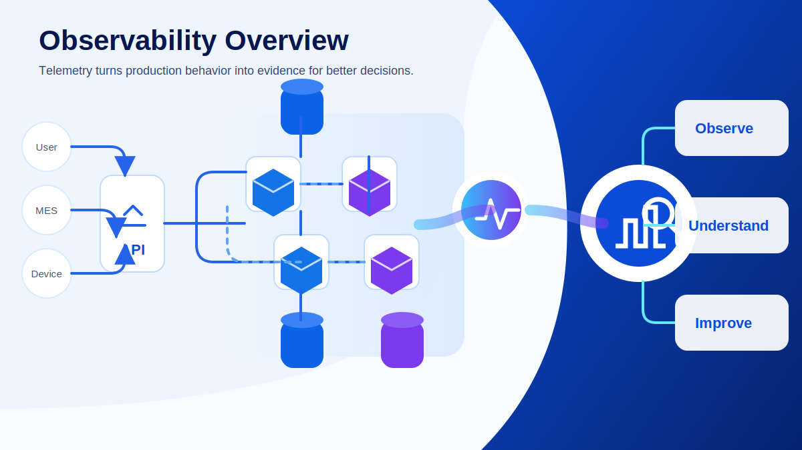
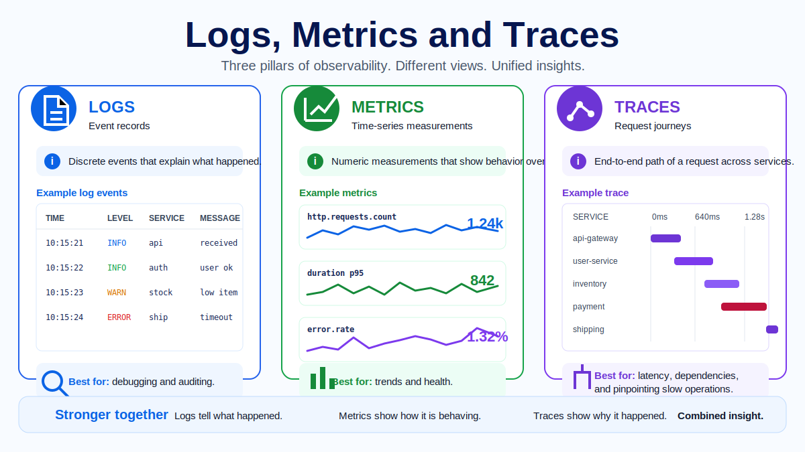
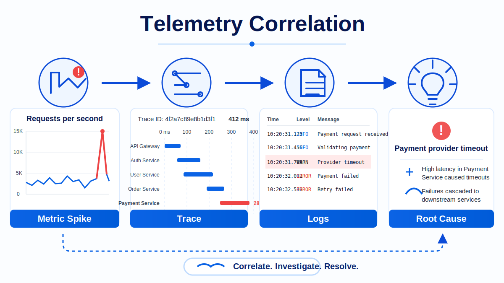
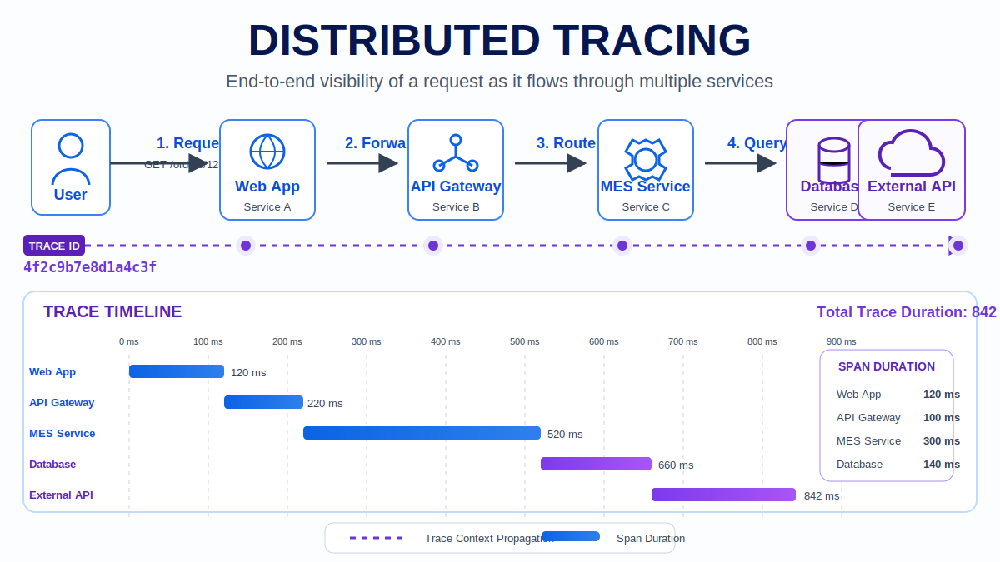

# Module 01 - Introduction to Observability

## Course context

Modern application environments are rarely made of one application server and one database. A single user action may cross a browser, an API gateway, authentication services, business services, message queues, databases, external APIs and infrastructure layers. When the user says that the screen is slow or an operation failed, the root cause is rarely visible in one log line or one CPU chart.

Observability exists to make this kind of system understandable. It gives engineers enough evidence to investigate what happened, where it happened, how it propagated and why the system behaved that way. The goal is not to collect every possible event. The goal is to collect meaningful telemetry that helps teams move from symptoms to evidence, from evidence to hypotheses and from hypotheses to action.

## Monitoring and observability

Monitoring is essential, but it is usually focused on known conditions. A monitor can tell us that CPU is above a threshold, that an endpoint is returning errors or that disk space is low. This is valuable because it detects symptoms quickly.

Observability goes further. It helps answer questions that were not fully known before the incident started: why only one endpoint is slow, why only some users are affected, which downstream dependency introduced latency, or whether a change in behavior started after a deployment. Monitoring says that something is wrong. Observability helps explain why.

A healthy production practice needs both. Monitoring wakes the team up. Observability gives the team enough context to make the next decision without guessing.

## The three telemetry signals

Observability is commonly built around logs, metrics and traces.

Logs are timestamped records of events. They are useful when we need detail: an exception, a validation failure, a rejected business rule or a timeout message. Good logs are structured and include useful fields such as service name, environment, trace id, span id, user or tenant context and exception details.

Metrics are numerical measurements over time. They show how the system is behaving: request rate, error rate, latency, CPU usage, memory pressure, queue depth or failed job count. Metrics are excellent for dashboards, alerting and trend analysis, but they usually need correlation with logs or traces to explain the cause.

Traces describe the journey of one request across service boundaries. A trace is made of spans, and each span represents an operation. Traces are especially useful when a request crosses multiple services and the team needs to find where time was spent or where failure started.

## Correlation

The strongest observability insight usually comes from combining signals. A metric may show that latency increased. A trace can identify that the payment service spent most of the request time waiting for a provider. Logs can confirm the timeout and provide the exact error message.

Correlation depends on shared context. Trace ids and span ids are the bridge between traces and logs. Service names, deployment environments and semantic attributes make it possible to filter evidence consistently. Without correlation, engineers often jump between tools and manually guess which events belong together.

## Distributed tracing

Distributed tracing is the practice of following a request from its entry point through each downstream operation. This is critical in systems where one user action may trigger API calls, database queries, asynchronous jobs and external integrations.

A trace should show the critical path: which service handled the request, which spans were slow, which calls failed and which attributes explain the business context. It should not merely be a decorative waterfall. It should be evidence that supports a decision.

## Practical investigation workflow

A simple observability investigation can follow this path:

1. Start with the symptom: what changed, who is affected and when did it begin?
2. Check high-level metrics: error rate, latency, throughput and saturation.
3. Open a representative trace: find the slowest or failing span.
4. Use trace ids to inspect related logs.
5. Form a hypothesis and validate it with additional evidence.
6. Take action and confirm that the symptom improved.

## Common mistakes

A common mistake is collecting data without knowing what question it answers. Another is adding logs that are technically correct but not actionable. Teams also frequently create dashboards that show many numbers but do not guide decisions. Observability should reduce uncertainty during incidents, not create more screens to inspect.

## Practice assets

The learner-facing practice material for this module is kept in dedicated files so it can be reused in workshops, self-study and slide delivery:

- [Exercise - Investigation summary](exercise.md)
- [Quiz - Review questions and answers](quiz.md)
- [Official references](references.md)

## Key takeaways

- Monitoring detects known symptoms; observability explains behavior.
- Logs, metrics and traces are complementary, not interchangeable.
- Correlation is what turns separate signals into an investigation story.
- OpenTelemetry provides a standard way to produce and transport telemetry.

## Next module

Continue with [Module 02 - OpenTelemetry Architecture](../module-02-opentelemetry-architecture/README.md).
