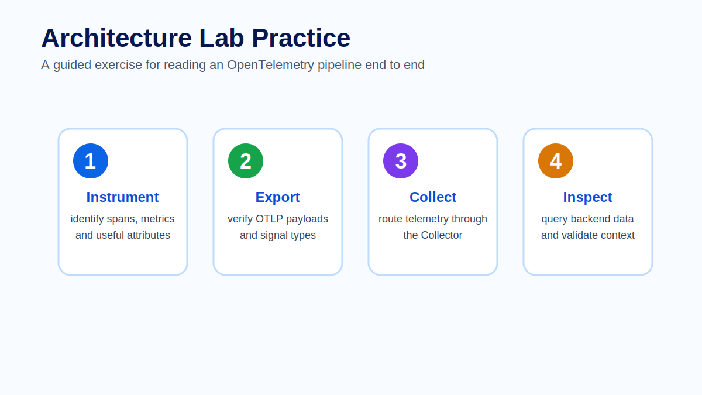

# Lab - Architecture mapping

## Goal

Design an OpenTelemetry architecture for a small distributed system and identify where telemetry is generated, transported, processed, stored and visualized.

This lab is intentionally diagram-first. It helps learners reason about architecture before they configure a Collector in Module 03.

## Scenario

You are designing observability for a checkout system with these components:

- one frontend application;
- two backend APIs;
- one database;
- one OpenTelemetry Collector;
- ClickHouse as the primary backend;
- Grafana as the visualization layer;
- optional OTLP forwarding to another Collector.



## Instructions

1. Draw the application components and label each telemetry source.
2. Add the OpenTelemetry SDK or instrumentation agent at each application boundary.
3. Draw OTLP transport from each instrumented component to the Collector.
4. Add the Collector processing stage and label where batching, filtering or enrichment may happen.
5. Draw exports to ClickHouse and Grafana's query path back to stored telemetry.
6. Add the optional forwarding path to another Collector.
7. Mark which part of the architecture owns each responsibility: generate, transport, process, store, visualize.

## Expected outcome

A strong solution should show this flow:

```text
Frontend and APIs -> OpenTelemetry SDK or agent -> OTLP -> Collector -> ClickHouse -> Grafana
```

It should also show that the database is often observed indirectly through application spans, database metrics and infrastructure telemetry, rather than by assuming every database emits the same signal format.

## Review checklist

- Every service has a clear `service.name`.
- OTLP is used between instrumented services and the Collector.
- The Collector is not treated as a database.
- ClickHouse is shown as storage, not instrumentation.
- Grafana is shown as a visualization and exploration layer.
- Optional forwarding is shown as an export path, not as a replacement for local processing.

## Instructor notes

Use learner diagrams to surface common architecture mistakes early. If a learner sends telemetry directly from every service to every backend, ask how they would change routing, filtering or sampling without redeploying applications. If a learner omits resource attributes, ask how an operator would filter telemetry during an incident.
