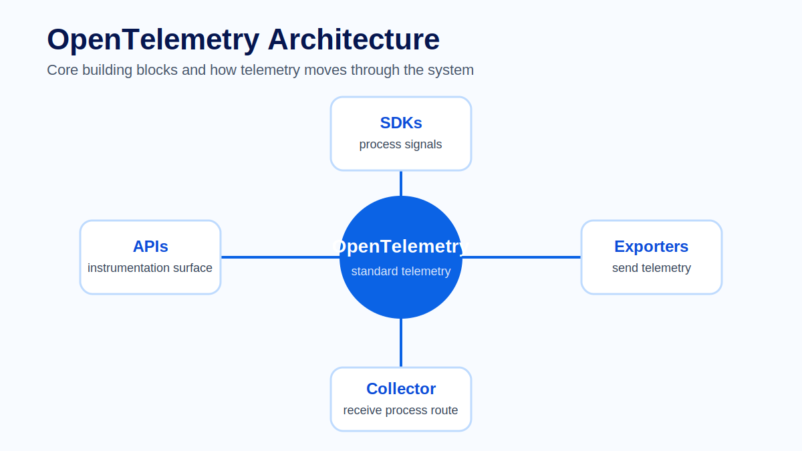
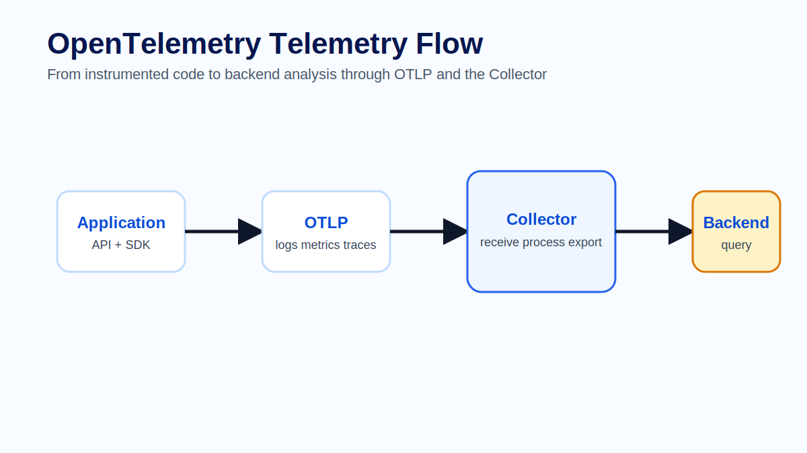
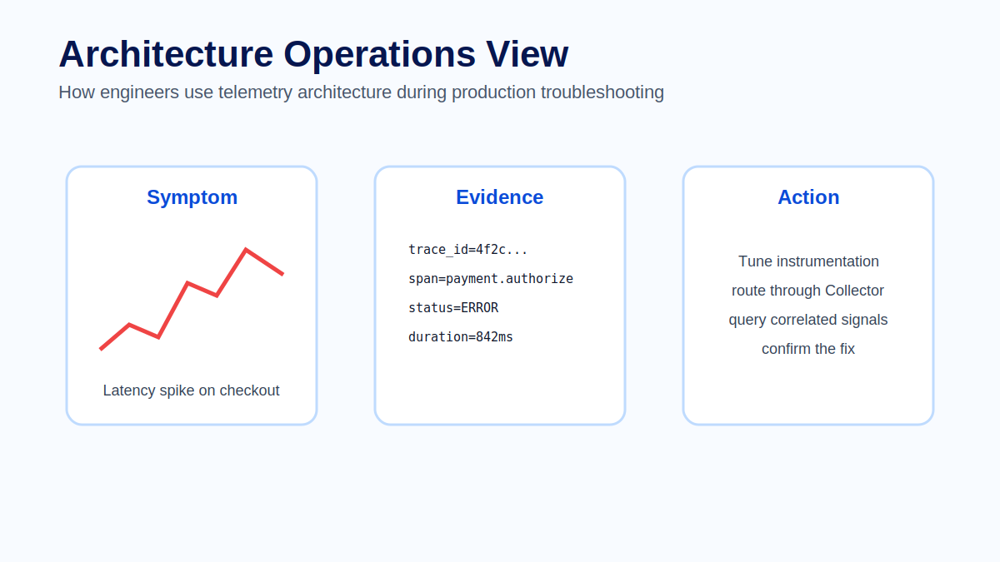

# Module 2 - OpenTelemetry Architecture

## Overview

Module 1 introduced the core idea of observability: the ability to understand the internal state of a system by analyzing the telemetry it produces. We discussed logs, metrics and traces as complementary signals and explored why correlation is essential for troubleshooting modern distributed systems.

The next question is natural: how does this telemetry actually travel from an application to an observability platform?

This module introduces the architecture of OpenTelemetry. It explains the main building blocks involved in collecting, transporting, processing and exporting telemetry data. The goal is not to turn participants into Collector experts yet; that will be covered in the next module. Instead, this module provides the architectural map required to understand how OpenTelemetry-based platforms are designed.



## Learning Objectives

After completing this module, participants will be able to:

- Explain why OpenTelemetry exists.
- Describe the main OpenTelemetry components.
- Understand the role of the SDK, Collector and OTLP.
- Describe how logs, metrics and traces flow through an observability architecture.
- Compare common deployment models such as agent, gateway and sidecar.
- Identify common architecture mistakes.

## Prerequisites

Participants should be familiar with:

- Basic observability concepts.
- Logs, metrics and traces.
- Basic HTTP and client/server communication.
- Basic understanding of distributed systems.

## Module Structure

1. Why OpenTelemetry?
2. OpenTelemetry Architecture Overview
3. OpenTelemetry Components
4. Telemetry Flow
5. OpenTelemetry SDK
6. OpenTelemetry Collector
7. OTLP
8. Deployment Models
9. Best Practices
10. Common Mistakes
11. Lab
12. Summary

## 2.1 Why OpenTelemetry?

Modern software rarely runs as a single process on a single server. A single user action may involve a browser, an API gateway, multiple backend services, databases, message queues and external systems. Each of these components may generate telemetry in a different format.

Before OpenTelemetry, teams often had to choose between vendor-specific agents, custom instrumentation libraries or different standards for different telemetry signals. This created fragmentation. A team could instrument tracing using one library, metrics using another, and logs using a third. Moving to another backend often required rewriting instrumentation or changing application code.

OpenTelemetry was created to solve this problem by providing a vendor-neutral standard for telemetry collection. Applications can be instrumented once and send telemetry to different observability backends without being tightly coupled to a single vendor.

> **Architect's Perspective**
>
> OpenTelemetry is not just a library. It is an architectural standard. Its most important value is that it separates telemetry generation from telemetry storage and visualization.

## 2.2 Architecture Overview

At a high level, an OpenTelemetry architecture contains the following stages:

```text
Application
    ->
OpenTelemetry SDK or Agent
    ->
OTLP
    ->
OpenTelemetry Collector
    ->
Backend Storage
    ->
Visualization and Alerting
```

The application generates telemetry. The SDK or agent captures that telemetry. OTLP transports it. The Collector receives, processes and exports it. The backend stores it. Grafana or another visualization layer allows engineers to query and analyze it.

This separation is one of the most important architectural characteristics of OpenTelemetry. Each stage has a clear responsibility and can evolve independently.



## 2.3 OpenTelemetry Components

An OpenTelemetry-based platform is built from several components.

### Instrumented Applications

Instrumented applications are the source of telemetry. They may be instrumented manually by developers or automatically using language agents and instrumentation libraries.

### OpenTelemetry SDK

The SDK runs inside the application process. It creates spans, records metrics, enriches telemetry with attributes and exports data to a configured destination.

### OTLP

OTLP is the OpenTelemetry Protocol. It defines how telemetry is transported between components. It supports gRPC and HTTP and is commonly used between applications, collectors and other telemetry systems.

### OpenTelemetry Collector

The Collector is a standalone component that receives telemetry, processes it and exports it to one or more destinations. It is optional in simple architectures, but strongly recommended in production environments.

### Observability Backend

The backend stores telemetry data. Examples include ClickHouse, Prometheus, Tempo, Loki, Jaeger or commercial observability platforms.

### Visualization Layer

Grafana is commonly used to query, visualize and alert on telemetry data stored in backends.

## 2.4 Telemetry Flow

A typical flow looks like this:

```text
Application -> SDK -> OTLP -> Collector -> ClickHouse -> Grafana
```

In more advanced architectures, the Collector may export telemetry to multiple destinations at the same time:

```text
Collector -> ClickHouse
Collector -> Prometheus
Collector -> Tempo
Collector -> Another Collector
```

This allows organizations to support local analysis, central aggregation, long-term storage and external integrations simultaneously.

## 2.5 Best Practices

- Always define `service.name`.
- Keep Resource Attributes consistent across services.
- Prefer OTLP for interoperability.
- Use the Collector to centralize processing logic.
- Avoid putting business-sensitive data in attributes.
- Design for multiple destinations from the beginning.

## 2.6 Common Mistakes

- Sending telemetry directly to a backend without considering future routing needs.
- Treating the Collector as a database.
- Using inconsistent service names.
- Creating high-cardinality metric attributes.
- Forgetting context propagation between services.

## Operational investigation view

When troubleshooting production issues, this architecture becomes a map. If telemetry is missing, the problem may be in instrumentation, SDK export, OTLP transport, Collector processing or backend ingestion. Engineers should be able to follow the path one stage at a time instead of treating observability as a black box.



## Practice assets

The learner-facing practice material for this module is kept in dedicated files so it can be reused in workshops, self-study and slide delivery:

- [Lab - Architecture mapping](lab.md)
- [Quiz - Review questions and answers](quiz.md)
- [Official references](references.md)

## Summary

OpenTelemetry provides the architecture and standards required to collect telemetry in a vendor-neutral way. Its main strength is the separation between instrumentation, transport, processing, storage and visualization.

In this module we introduced the SDK, OTLP, the Collector, backends and Grafana. The next module will focus entirely on the OpenTelemetry Collector, which is one of the most important components in production observability architectures.

## Next Module

Module 3 explores the OpenTelemetry Collector in depth, including receivers, processors, exporters, extensions, pipelines and production deployment patterns.
