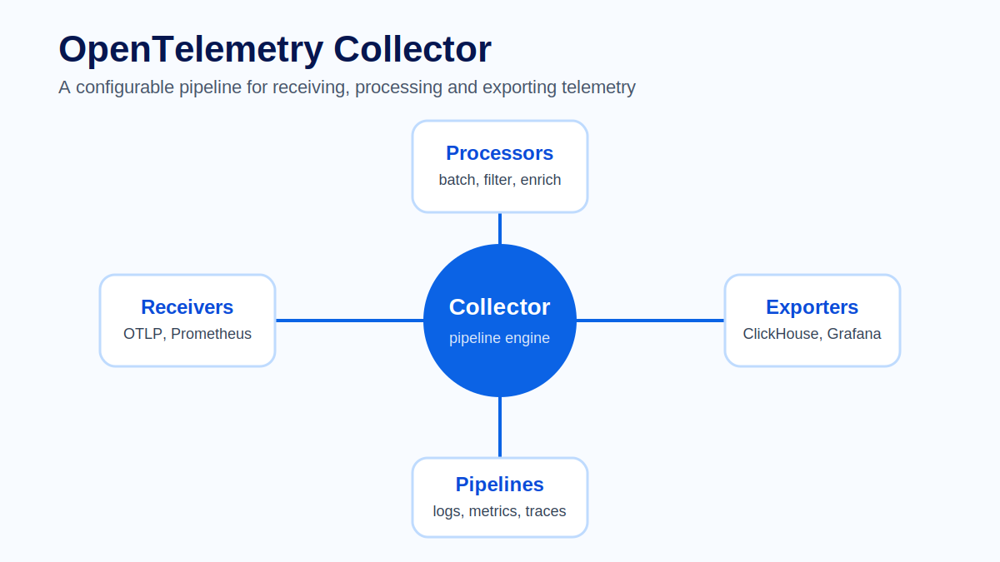
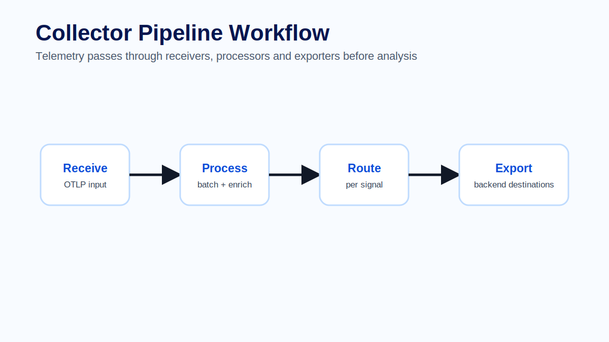
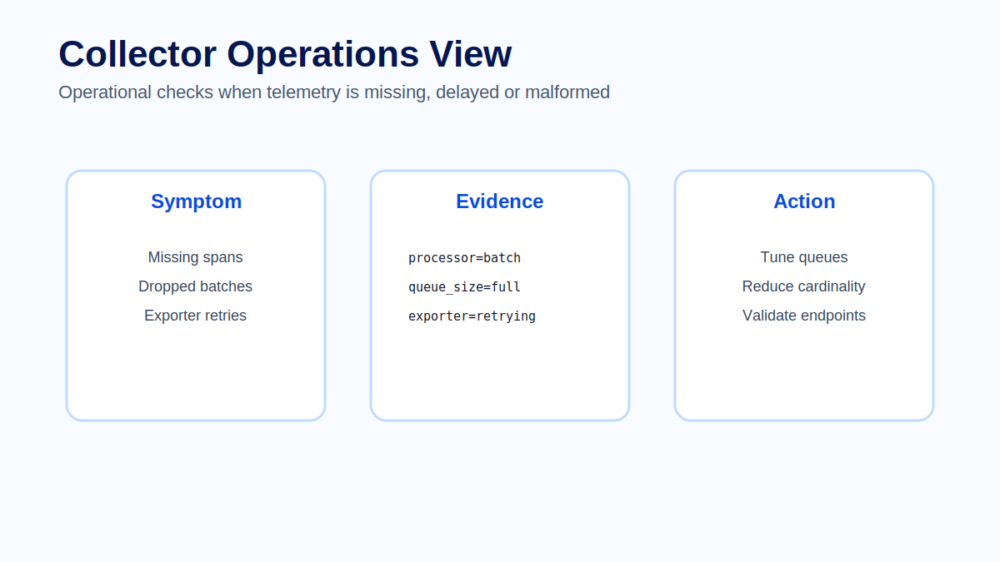

# Module 03 - OpenTelemetry Collector

## Overview

Module 02 introduced the OpenTelemetry architecture: applications generate telemetry, OTLP transports it, the Collector processes it and backends store it for analysis. This module zooms into the OpenTelemetry Collector, one of the most important production control points in an observability platform.

The Collector is the telemetry pipeline between applications and observability backends. It receives logs, metrics and traces, processes them and exports them to one or more destinations. In production, the Collector is often where teams enforce consistency, reduce noise, control cost and decouple applications from backend-specific details.

Without a Collector, every application may need to know where to send telemetry, how to retry, how to batch, how to filter and how to authenticate. That approach does not scale well. The Collector gives platform teams a central place to operate telemetry flow.



## Learning Objectives

After completing this module, participants will be able to:

- Explain why the OpenTelemetry Collector is used in production architectures.
- Describe receivers, processors, exporters, extensions and pipelines.
- Read a basic Collector configuration and explain how telemetry moves through it.
- Compare direct export, agent, gateway, sidecar and hybrid deployment patterns.
- Identify Collector health signals and common failure modes.
- Explain operational trade-offs around batching, filtering, enrichment, routing and retries.

## Prerequisites

Participants should be familiar with:

- Logs, metrics and traces.
- Basic OpenTelemetry architecture from Module 02.
- OTLP as a telemetry transport protocol.
- Basic YAML configuration.
- Basic container and Docker Compose usage for the hands-on lab.

## Module Structure

1. Why the Collector matters.
2. Collector architecture.
3. Core building blocks.
4. Telemetry pipelines.
5. Deployment patterns.
6. Production operations.
7. Common mistakes.
8. Hands-on practice.
9. Summary.

## 3.1 Why the Collector Matters

The Collector exists because telemetry pipelines become operational systems. At small scale, an application can send telemetry directly to a backend. At production scale, that direct path becomes difficult to govern.

Applications should focus on generating useful telemetry. They should not need to know every backend endpoint, retry policy, queue setting, export format or routing rule. Those concerns belong in a shared telemetry layer that platform teams can operate consistently.

The Collector provides that layer. It receives telemetry from applications and infrastructure, applies processing rules, and exports the result to one or more destinations. It can also help teams migrate between backends, split signals across storage systems and enforce organization-wide metadata standards.

> **Architect Note**
>
> The Collector is not a database, dashboard or tracing system. It is a pipeline runtime. Its architectural value is control: it gives teams a stable place to apply telemetry policy without redeploying every instrumented application.

## 3.2 Collector Architecture

A Collector deployment is usually built from a small set of component types:

```text
Telemetry source
    -> receiver
    -> processor chain
    -> exporter
    -> backend or next Collector
```

The service section of a Collector configuration connects these components into pipelines. A pipeline is defined per signal type, such as traces, metrics or logs.

```text
receivers:  otlp
processors: memory_limiter -> resource -> batch
exporters:  clickhouse, debug
service:    traces pipeline uses the receiver, processors and exporters
```

The same Collector process can run separate pipelines for logs, metrics and traces. Each pipeline can use a different set of processors and exporters.



> **Production Example**
>
> A checkout service sends OTLP traces, metrics and logs to a local Collector. The traces pipeline adds resource attributes, batches spans and exports them to ClickHouse. The metrics pipeline drops high-cardinality labels before export. The logs pipeline redacts sensitive fields and sends only structured application logs to long-term storage. The application knows only one endpoint: the Collector.

## 3.3 Core Building Blocks

A Collector configuration is built around receivers, processors, exporters, extensions and pipelines.

### Receivers

Receivers accept telemetry. An OTLP receiver is common because applications and agents can send standard OpenTelemetry data to it. Other receivers may scrape Prometheus metrics, receive host metrics or accept data from existing telemetry systems.

Receivers define the ingestion boundary. If telemetry never reaches a receiver, no processor or exporter can fix the pipeline. This is why endpoint, protocol, port, TLS and authentication settings matter.

### Processors

Processors modify telemetry while it moves through the pipeline. Common processors batch data, add resource attributes, filter unwanted telemetry, redact sensitive fields or control memory usage.

Processors are powerful because they can improve telemetry quality without changing application code. They also carry risk. A filter processor can reduce cost, but it can also remove the evidence needed during an incident. A resource processor can standardize attributes, but an inconsistent rule can make service identity harder to query.

### Exporters

Exporters send telemetry to destinations. A Collector may export traces to ClickHouse, metrics to Prometheus-compatible storage, logs to long-term storage and selected telemetry to another Collector.

Exporters are where queueing, retries and backend availability become important. A backend outage should not automatically mean immediate data loss, but an infinite queue is not realistic either. Production teams need explicit decisions about retry behavior, queue limits and acceptable loss.

### Extensions

Extensions provide capabilities that support the Collector process rather than processing a specific telemetry signal. Common examples include health check endpoints, diagnostics, profiling, authentication helpers or other process-level features.

Extensions are important because the Collector must be operated like any other production service. If teams cannot check Collector health, inspect its behavior or secure its endpoints, the telemetry platform becomes fragile.

### Pipelines

Pipelines connect receivers, processors and exporters per signal. A traces pipeline may use a batch processor and export to ClickHouse. A metrics pipeline may use different filtering and export to a metrics backend. A logs pipeline may redact attributes before storage.

Pipelines are the reason the Collector is more than a forwarding proxy. They let teams apply different policies to different signals.

## 3.4 Reading a Collector Pipeline

When reading a Collector configuration, start with the `service.pipelines` section. It tells you which components are actually active.

A component can be defined but unused. For example, an exporter listed under `exporters` does nothing unless a pipeline references it. This distinction matters when debugging configuration files that have grown over time.

A practical review sequence is:

1. Identify the signal type: traces, metrics or logs.
2. Identify the receiver and where telemetry enters.
3. Read processors in order because ordering changes behavior.
4. Identify exporters and what failure means for each destination.
5. Check extensions and telemetry settings used to operate the Collector itself.

> **Best Practice**
>
> Keep Collector pipelines intentionally small. Add processors because there is a clear operational need, not because a processor exists. Every processor can change data shape, latency, memory usage or failure behavior.

## 3.5 Deployment Patterns

The Collector can run in several patterns. The right choice depends on scale, ownership, network topology and reliability requirements.

| Pattern | Description | Strength | Risk |
|---|---|---|---|
| Direct export | Applications send telemetry directly to a backend. | Simple for demos and small systems. | Couples application config to backend policy. |
| Agent Collector | Collector runs near workloads, such as on each node. | Local ingestion, enrichment and batching. | More Collector instances to operate. |
| Gateway Collector | Central Collector tier receives telemetry from many sources. | Central policy, routing, authentication and fan-out. | Can become a critical dependency if undersized. |
| Sidecar Collector | Collector runs beside one workload. | Isolated processing or protocol translation. | More runtime overhead per workload. |
| Hybrid | Agents forward to gateways before backend export. | Balances local collection and central policy. | More moving parts and ownership boundaries. |

Many production environments use a hybrid model. Agents reduce network distance and add local context. Gateways centralize routing, authentication and multi-backend export.

Choosing a deployment pattern is an architecture decision, not a syntax decision. A gateway is easier to manage centrally, but it must be scaled and monitored carefully. Agents reduce distance to workloads, but the fleet becomes larger.

## 3.6 Production Operations

Collector operations are not only about configuration syntax. Engineers must monitor dropped data, exporter queue size, retry behavior, memory usage and backend availability. A Collector that silently drops spans during an incident can make troubleshooting harder precisely when telemetry is most needed.



Useful health questions include:

- Is the Collector receiving telemetry from expected services?
- Are processors dropping or transforming data intentionally?
- Are exporters failing, retrying or queueing data?
- Is memory pressure causing data loss?
- Are pipelines balanced by signal volume and backend capacity?
- Can operators distinguish application silence from Collector failure?

Batching improves efficiency, but large batches may increase latency. Filtering reduces cost, but aggressive filters may remove evidence. Enrichment improves context, but inconsistent resource attributes make queries harder. Retries improve resilience, but queues still need limits.

> **Common Mistake**
>
> A team deploys a gateway Collector and routes every signal from every service through it, but does not monitor Collector health. During a backend outage, exporter queues fill and telemetry is dropped. The incident dashboard shows missing data, but engineers cannot tell whether the application stopped emitting telemetry or the Collector dropped it. The fix is to make Collector self-observability part of the platform from the beginning.

## 3.7 Common Mistakes

Common Collector mistakes usually come from treating the pipeline as a place to add everything instead of a place to make explicit trade-offs.

- Putting every possible processor into every pipeline.
- Routing all signals to all destinations without asking who will use them.
- Filtering telemetry without documenting what evidence is being removed.
- Using inconsistent resource attributes across pipelines.
- Forgetting to monitor exporter failures and queue pressure.
- Treating the Collector as permanent storage.
- Changing shared gateway policy without understanding downstream dashboard and alert dependencies.

A good Collector design is boring in the best way: clear inputs, intentional processors, known outputs, monitored failure modes and documented ownership.

## Hands-on Practice

The learner-facing practice material for this module is kept in dedicated files so it can be reused in workshops, self-study and slide delivery:

- [Exercise - Pipeline review](exercise.md)
- [Lab - Collector to ClickHouse pipeline](../../labs/module-03-collector-clickhouse-pipeline.md)
- [Quiz - Review questions and answers](quiz.md)
- [Official references](references.md)

## Common Interview Questions

1. Why is the Collector commonly recommended in production OpenTelemetry architectures?
2. What is the difference between a receiver, processor and exporter?
3. Why does the order of processors in a pipeline matter?
4. When would you choose an agent Collector, a gateway Collector or both?
5. What Collector health signals would you monitor in production?
6. Why is aggressive filtering risky during incident investigation?
7. How does the Collector help decouple applications from observability backends?
8. What is the difference between a Collector pipeline and a backend storage system?

## Summary

The OpenTelemetry Collector is the operational pipeline for telemetry. It gives platform teams a controlled place to receive, process, route and export logs, metrics and traces without forcing every application to own backend-specific behavior.

In this module we covered receivers, processors, exporters, extensions and pipelines. We also compared deployment patterns and examined production concerns such as batching, filtering, enrichment, retries, queue pressure and dropped telemetry.

## Key Takeaways

- The Collector is a pipeline runtime, not a database or dashboard.
- Receivers ingest telemetry, processors modify it, exporters send it onward and extensions support the Collector process.
- Pipelines are configured per signal and should be intentionally designed.
- Agent and gateway Collectors solve different operational problems and are often combined.
- Collector self-observability is mandatory because Collector failure can hide application truth.
- Every processing decision has a trade-off in cost, latency, fidelity or reliability.

## Next Module

Module 04 focuses on logs: how structured log events support investigations, how they connect to traces and metrics, and how teams control log volume, sensitivity and storage cost.
