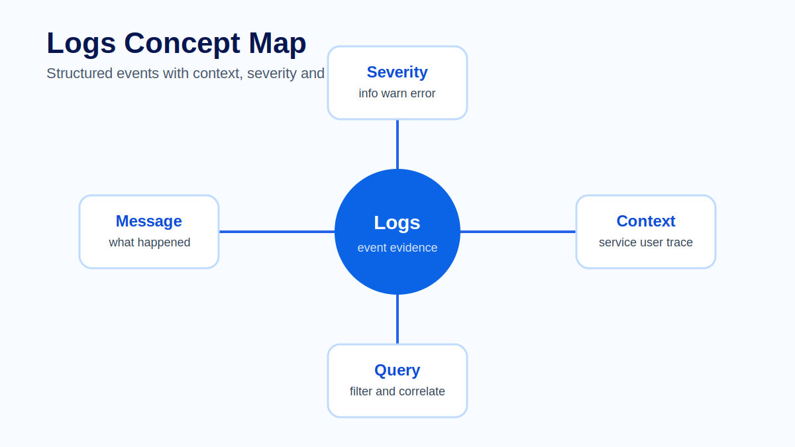
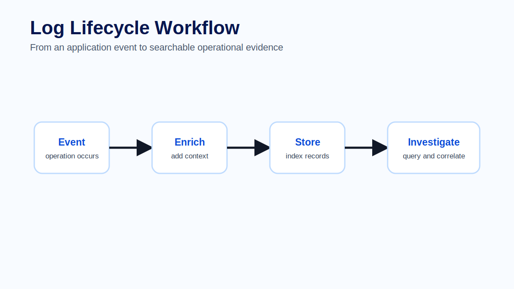
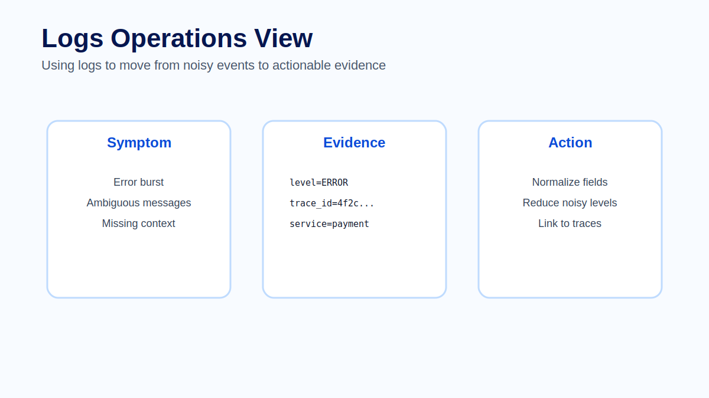

# Module 04 - Logs

## Overview

Module 03 showed how the OpenTelemetry Collector receives, processes and exports telemetry. This module focuses on one of the most familiar telemetry signals: logs.

Logs are often the first signal engineers reach for during an incident. They are also one of the easiest signals to misuse. A log can be excellent evidence, or it can be a stream of vague messages that creates more noise than clarity.

A log is a timestamped event. It should describe something that happened in the system and include enough context for an engineer to decide what to do next. In production troubleshooting, logs answer questions such as: what failed, which service reported it, which operation was running, which user or tenant was affected and which trace contains the related request.

## Learning Objectives

After completing this module, participants will be able to:

- Explain logs as structured event evidence, not generic text output.
- Describe the main parts of an OpenTelemetry log record.
- Design actionable structured logs with safe operational context.
- Explain how logs correlate with traces and metrics.
- Use severity levels to communicate operational meaning.
- Identify common logging mistakes around noise, sensitivity, retention and inconsistent fields.

## Prerequisites

Participants should be familiar with:

- Basic observability concepts from Module 01.
- OpenTelemetry architecture and Collector pipelines from Modules 02 and 03.
- Trace and span identifiers at a conceptual level.
- Basic JSON or structured data fields.
- The shared Docker Compose lab environment used by the course.

## Module Structure

1. Why logs matter.
2. Log record anatomy.
3. Structured logging.
4. Severity and noise.
5. Correlation with traces and metrics.
6. Production guidance.
7. Common mistakes.
8. Hands-on practice.
9. Summary.

## 4.1 Why Logs Matter

Logs are detailed event evidence. They record what happened at a specific point in time. That detail makes them useful when an engineer needs to understand a failure path, exception, dependency response or business rule decision.

Logs are also expensive and risky when used without discipline. They can grow quickly, expose sensitive data and bury important events under low-value messages. A production logging strategy must balance investigation value against cost, privacy, retention and operational noise.

> **Architect Note**
>
> Logs should not be the only observability signal. Metrics are better for trends and alert thresholds. Traces are better for request flow and latency breakdown. Logs are strongest when they provide event-level evidence that can be correlated with those other signals.

## 4.2 Log Record Anatomy

A useful log record contains more than a message string. In OpenTelemetry terms, a log record can include fields such as timestamp, observed timestamp, severity, body, attributes, resource attributes, trace id and span id.

| Part | Purpose |
|---|---|
| Timestamp | When the event occurred. |
| Severity | Operational importance of the event. |
| Body | Human-readable event message or structured body. |
| Attributes | Event-specific context such as operation, failure reason or dependency name. |
| Resource attributes | Entity that produced the log, such as service name and environment. |
| Trace id and span id | Correlation bridge to the request trace. |

The exact storage schema depends on the backend, but the design principle is stable: logs should carry enough structured context to support investigation without exposing unsafe data.

> **Production Example**
>
> A checkout service logs a payment authorization timeout. A weak log says `Payment failed`. A production-quality structured log includes `service.name=checkout-api`, `deployment.environment=production`, `severity=ERROR`, `operation=authorize_payment`, `payment.provider=stripe`, `failure.reason=provider_timeout`, a safe `tenant.id`, and the related trace id and span id. That event gives the engineer a query path and a trace-correlation path.

## 4.3 Structured Logging

Structured logs store context as fields instead of burying everything in a sentence. This makes logs easier to filter, aggregate and correlate.

A poor log says `Error occurred`. A useful log says that payment authorization failed for a specific operation, with a provider timeout, in a specific service and trace. The second log gives the engineer a path forward.

Useful fields often include `service.name`, `deployment.environment`, `trace_id`, `span_id`, `http.route`, `exception.type`, `exception.message`, `db.system` and a safe business identifier. The exact fields depend on the system, but the principle is stable: logs should carry context that supports investigation.

Structured logging also improves consistency across teams. If one service uses `tenant`, another uses `tenantId` and another uses `customer`, cross-service queries become harder. Field naming is an architecture decision because it shapes how future investigations work.

> **Best Practice**
>
> Define a small set of standard log fields for the platform. At minimum, standardize service identity, environment, operation name, severity, trace id, span id, error type and safe business identifiers. Let teams add domain-specific fields, but keep the investigation backbone consistent.

## 4.4 Severity and Noise

Severity levels should communicate operational importance. If everything is a warning, nothing is a warning. If expected business rejections are logged as errors, alerting and dashboards become noisy. Teams should define what `info`, `warn`, `error` and `critical` mean in their environment.

Good severity design helps operators distinguish normal behavior from degraded behavior. It also supports better routing, alerting and retention decisions.

Severity should describe response urgency, not developer frustration. A validation failure caused by expected user input may be useful at `info` or `debug`. A dependency timeout affecting checkout requests may be `error`. A payment outage affecting all regions may be `critical`.

Noise control is not only about reducing storage cost. Excessive low-value logs make real incidents harder to see. The goal is not fewer logs at any cost; the goal is better evidence per stored event.

## 4.5 Correlation with Traces and Metrics

Logs become much more powerful when they are correlated with traces and metrics. Metrics may show that the error rate increased. A trace may show that payment authorization failed. Logs can provide the exact exception, provider response or business rule involved.

The trace id is the bridge. If application logs include trace and span identifiers, engineers can move from a trace to the related logs without guessing time windows or service names.

A practical investigation often moves like this:

1. A metric alert shows checkout error rate increased.
2. A dashboard identifies the affected service and route.
3. A trace shows latency or failure in the payment authorization span.
4. Logs linked by trace id show the dependency timeout and safe tenant context.
5. Engineers decide whether the issue is application logic, dependency behavior or platform routing.

Logs without correlation force engineers to search by approximate time windows. Correlated logs let them move from symptom to request evidence much faster.

## 4.6 Production Guidance

Logs should be designed for repeated investigation. Avoid logging secrets, personal data or raw payloads. Avoid high-volume debug logs in normal production operation. Avoid messages that only make sense to the original developer. Prefer stable event names and structured attributes.

Retention also matters. Not every log needs the same lifetime. Security, audit, operational and debug logs may have different retention requirements and access controls.

Production logging decisions should answer:

- Which logs are needed for incident response?
- Which logs are needed for audit or compliance?
- Which logs are too sensitive to store broadly?
- Which fields are safe for indexing and grouping?
- Which logs should have short retention because they are high volume?
- Which logs should be sampled, filtered or disabled outside debugging windows?

> **Common Mistake**
>
> A team logs full payment request payloads to make debugging easier. The logs include sensitive customer and payment data, are retained for months and are visible to too many users. The short-term debugging benefit creates a long-term security and compliance problem. The safer design is to log stable event names, failure reasons, safe identifiers and correlation ids, while keeping sensitive payloads out of telemetry storage.

## 4.7 Common Mistakes

Common mistakes include logging too much, logging too little, using inconsistent field names and treating logs as the only observability signal. Logs are detailed, but they are not always efficient for trends or request timelines. Use them together with metrics and traces.

Additional mistakes to watch for:

- Logging vague messages such as `failed` or `unexpected error` without context.
- Using severity levels inconsistently across services.
- Logging raw credentials, tokens, personal data or full request bodies.
- Creating unbounded high-cardinality fields without considering storage and query impact.
- Failing to include trace id and span id in application logs.
- Treating debug logs as a permanent production default.
- Changing field names without updating dashboards, alerts and runbooks.

Good logging is not about writing more messages. It is about designing events that help an engineer make the next decision.

## Hands-on Practice

The learner-facing practice material for this module is kept in dedicated files so it can be reused in workshops, self-study and slide delivery:

- [Exercise - Structured log rewrite](exercise.md)
- [Lab - Structured log ingestion with OTLP](../../labs/module-04-structured-log-ingestion.md)
- [Quiz - Review questions and answers](quiz.md)
- [Official references](references.md)

## Common Interview Questions

1. What makes a log entry actionable during an incident?
2. Why are structured logs more useful than free-text-only logs?
3. Which fields help correlate logs with traces?
4. How should a team define severity levels across services?
5. Why is logging raw request payloads risky in production?
6. When are logs a poor substitute for metrics or traces?
7. How would you reduce log volume without removing important evidence?
8. What retention differences might exist between debug, operational, security and audit logs?

## Summary

Logs are timestamped event evidence. They are most useful when they are structured, safe, consistently named and correlated with traces and metrics. A good log gives an engineer a path forward; a poor log adds volume without insight.

In this module we covered log record anatomy, structured logging, severity, noise, correlation, retention and safe production practices. The next module moves from event evidence to metrics: numeric measurements that support trends, alerting and service-level decision-making.

## Key Takeaways

- Logs should describe events with enough context to support the next operational decision.
- Structured fields make logs searchable, aggregatable and correlatable.
- Severity must have shared operational meaning.
- Trace id and span id connect log evidence to request flow.
- Safe logging requires intentional decisions about sensitive data, retention and access.
- Logs complement metrics and traces; they should not replace them.

## Next Module

Module 05 focuses on metrics: counters, gauges, histograms, labels, cardinality and the design decisions that make measurements useful for dashboards and alerts.
