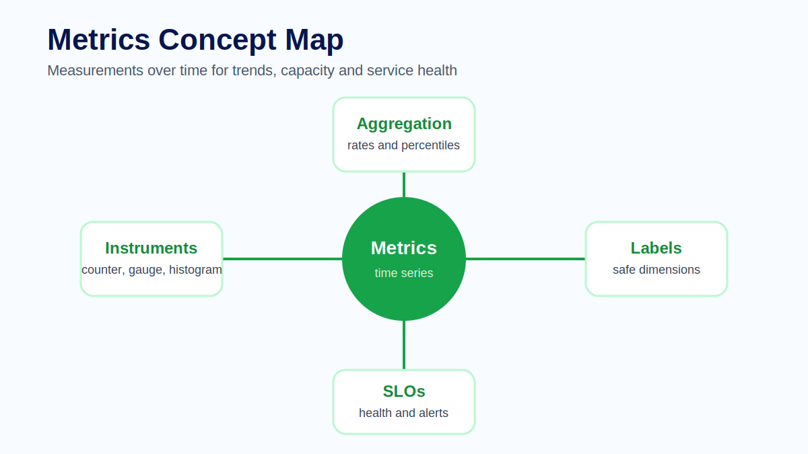
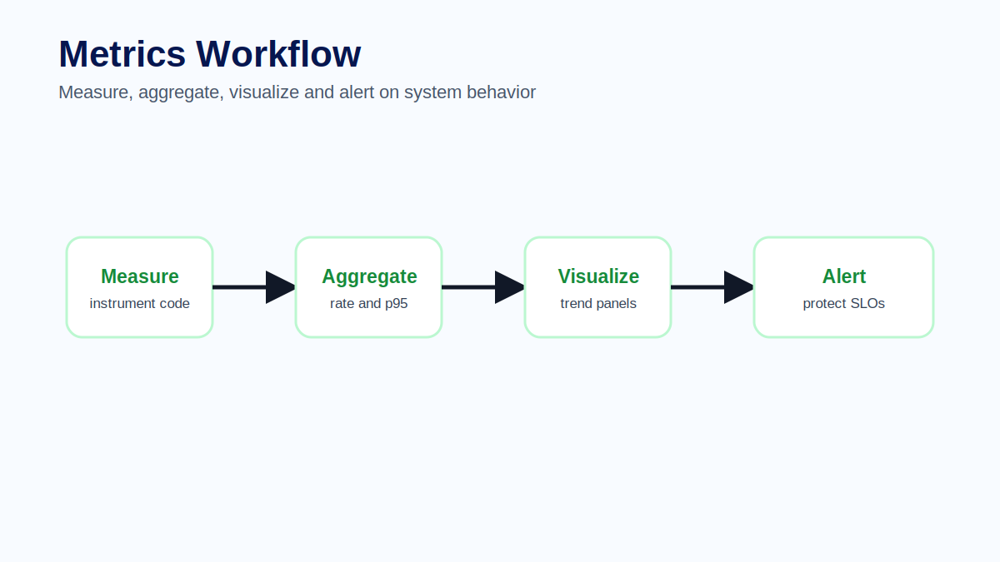
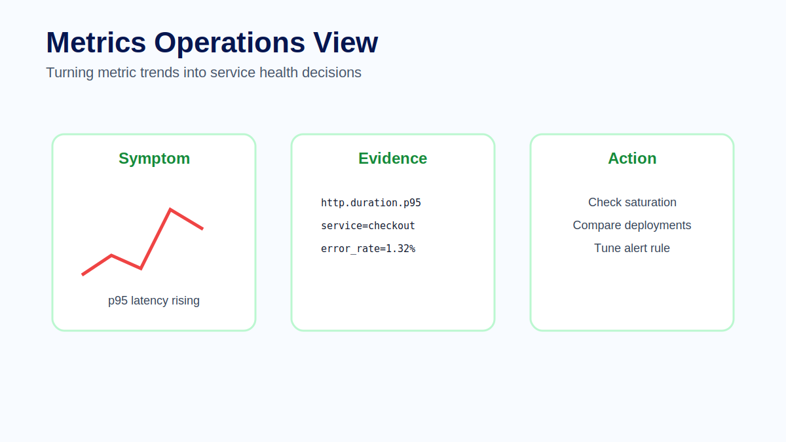

# Module 05 - Metrics

## Course context

Metrics describe system behavior as numbers over time. They are the signal most commonly used for dashboards, alerting, capacity planning and service health. If logs explain individual events and traces explain individual request journeys, metrics explain patterns.

A metric can show that request latency is rising, that error rate increased after a deployment, that memory usage is approaching a limit or that a queue is growing faster than workers can process it. Metrics are powerful because they are compact, fast to query and well suited to trend analysis.

## Metric instruments

A counter represents a value that only increases. Request count, error count and processed message count are common examples. Counters are usually queried as rates because the raw value is less useful than the change over time.

A gauge represents a value that can go up or down. Memory usage, active sessions, current queue depth and open connections are examples. Gauges describe current state.

A histogram records a distribution of measurements. Request duration and database query duration are common examples. Histograms are useful because they support percentiles such as p50, p95 and p99.

## Rates, percentiles and aggregation

Metrics become useful when they are aggregated correctly. A request counter can become requests per second. A duration histogram can become p95 latency. An error counter can become error rate. These derived views are what operators usually need.

Average latency is often misleading because it hides tail behavior. A system may have a reasonable average while a significant number of users experience slow requests. Percentiles show how the slower part of the distribution behaves.

## Labels and cardinality

Labels add dimensions to metrics. They allow queries such as latency by service, route, environment or status code. Labels are essential, but they can also create high cardinality.

High cardinality happens when a label has too many distinct values. User id, request id, session id or raw URL paths can create excessive time series. This increases storage cost and query complexity. A good metric label should help answer an operational question without exploding the number of series.

## Metrics in production

Metrics are ideal for health indicators: latency, traffic, errors and saturation. These four categories help teams understand whether a service is handling load, whether it is failing, whether users are waiting and whether resources are constrained.

Metrics alone usually do not explain root cause. If p95 latency rises, the next step is often to inspect traces and logs for representative requests. Metrics detect and prioritize; traces and logs explain.

## Common mistakes

Common mistakes include using averages for user experience, adding unsafe labels, creating metrics without clear ownership and alerting on symptoms that do not require action. Another mistake is using metrics as a substitute for logs or traces. Metrics show the shape of behavior, not every detail.

## Exercise

Design three metrics for a checkout service: one counter, one histogram and one gauge. For each metric, choose labels and explain why each label is safe. Then write one query or dashboard question the metric should answer.

## Quiz

1. What is the difference between a counter and a gauge?
2. Why are percentiles often better than averages for latency?
3. What is high cardinality?
4. Why should request ids not be metric labels?
5. What should you inspect after a metric shows a latency spike?

## Key takeaways

- Metrics show behavior over time.
- Counters, gauges and histograms answer different questions.
- Labels are useful but must be controlled.
- Metrics detect trends; correlation explains causes.

## Official references

- OpenTelemetry Metrics: https://opentelemetry.io/docs/specs/otel/metrics/
- OpenTelemetry Semantic Conventions: https://opentelemetry.io/docs/specs/semconv/
- Prometheus Data Model: https://prometheus.io/docs/concepts/data_model/
- Grafana Metrics Documentation: https://grafana.com/docs/
