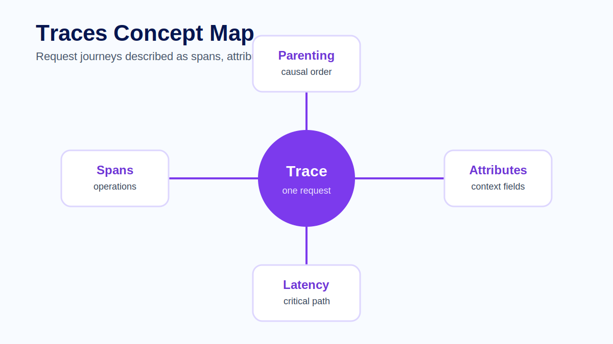
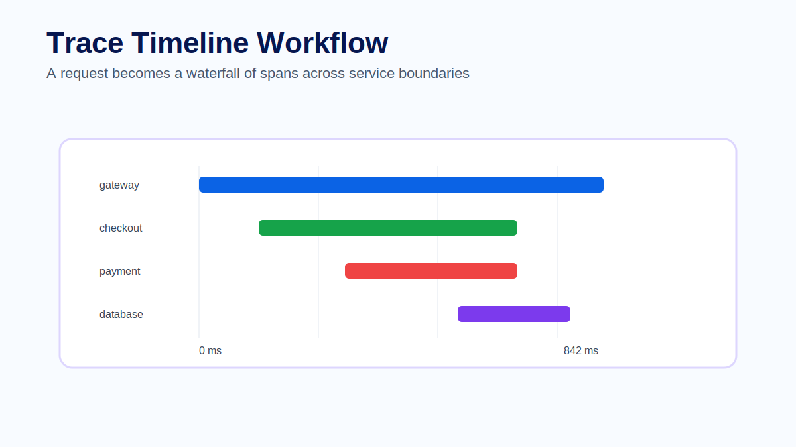
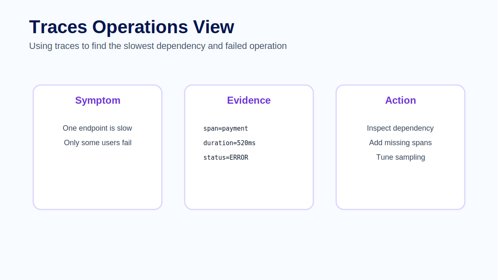

# Module 06 - Traces

## Overview

Module 05 explained metrics as numerical evidence for behavior over time. Metrics can show that latency increased or errors spiked, but they usually do not show where a single request spent its time. That is the job of traces.

A distributed trace tells the story of one request as it moves through a system. In a modern application, one user action may call an API gateway, several services, a database, a message queue and an external provider. Without tracing, engineers often know that something is slow but not where the time was spent.

A trace is made of spans. Each span represents an operation, such as handling an HTTP request, executing a database query or calling another service. Spans have timing, status and attributes. Together they form a waterfall that shows causality and latency.

## Learning Objectives

After completing this module, participants will be able to:

- Explain traces as request-level evidence for distributed systems.
- Describe trace ids, span ids, parent-child relationships, root spans and span attributes.
- Use a trace timeline to identify critical path and latency contributors.
- Explain how traces correlate with metrics and logs.
- Compare head sampling and tail sampling trade-offs.
- Identify common tracing mistakes around naming, missing spans, sensitive attributes and broken context propagation.

## Prerequisites

Participants should be familiar with:

- Logs, metrics and traces from Module 01.
- OpenTelemetry architecture from Module 02.
- Collector pipelines from Module 03.
- Structured logs from Module 04.
- Metrics and alerting concepts from Module 05.

## Module Structure

1. Why traces matter.
2. Trace anatomy.
3. Spans and attributes.
4. Trace timelines and critical path.
5. Context propagation dependency.
6. Sampling trade-offs.
7. Correlation with logs and metrics.
8. Common mistakes.
9. Hands-on practice.
10. Summary.

## 6.1 Why Traces Matter

Distributed systems hide cause inside boundaries. A request may enter through an API gateway, call a checkout service, query inventory, call a payment provider and publish an event. If the user sees a slow response, a single service log may not explain the whole journey.

Traces make the journey visible. They show which operations happened, how they were related, how long each operation took and where errors appeared.

Traces are especially useful for:

- latency breakdown;
- dependency investigation;
- first-failing-span analysis;
- request flow validation;
- understanding whether work happened sequentially or in parallel;
- connecting metrics and logs to a concrete request example.

> **Architect Note**
>
> Traces are not just performance diagrams. They are causality records. A good trace helps engineers reason about what caused what, not only how long each operation took.

## 6.2 Trace Anatomy

A trace contains one or more spans that share a trace id. Each span has its own span id. Parent-child relationships connect spans into a request tree.

| Concept | Meaning |
|---|---|
| Trace id | Identifier shared by all spans in one request journey. |
| Span id | Identifier for one operation inside the trace. |
| Parent span | The operation that caused or called another operation. |
| Root span | The first or top-level span in the trace. |
| Attributes | Structured context about the operation. |
| Status | Whether the operation succeeded, failed or ended with an error state. |
| Events | Timestamped details inside a span, such as an exception event. |

A trace can be visualized as a waterfall, but the underlying model is a set of spans with timing and relationships. That relationship model is what lets engineers find the critical path and understand causality.

> **Production Example**
>
> A checkout trace starts with an API gateway span, then a checkout service span, then child spans for inventory lookup, payment authorization and database write. The request takes 842 ms. The payment authorization span consumes 690 ms and has status error with `failure.reason=provider_timeout`. The trace shows where the time went, and the related log explains the provider failure in more detail.

## 6.3 Spans and Attributes

A good span should represent an operation that matters during investigation. Automatic instrumentation creates useful baseline spans for frameworks, HTTP clients and database drivers. Manual instrumentation adds business meaning, such as `checkout.authorize_payment` or `mes.execute_operation`.

Attributes add context to spans. They may include route, method, status code, database system, peer service, operation name or safe business dimensions. Attributes should help answer questions without exposing sensitive data.

Span status communicates whether an operation succeeded or failed. Errors should be attached to the span where the failure happened, not only to a later span that observed the consequence.

Good span names are stable and meaningful. `HTTP GET` is often too generic. `GET /checkout/{cart_id}` may be useful if the route is templated and bounded. `checkout.authorize_payment` can be useful when a business operation needs to appear clearly in traces.

> **Best Practice**
>
> Combine automatic instrumentation with a small number of manual business spans. Automatic spans give broad coverage. Manual spans give domain meaning. Avoid instrumenting every tiny function; trace detail should help investigations, not bury them.

## 6.4 Trace Timelines and Critical Path

A trace timeline helps engineers identify the critical path. If a request took 842 ms, the trace should show which spans consumed that time. It should also show whether operations were sequential or parallel.

This makes traces especially useful for performance investigations. A team can see whether time was spent in the application, database, external provider or queue. When a request fails, the trace can identify the first failing span rather than only the final error response.

A useful trace review asks:

1. What is the root span?
2. Which spans are on the critical path?
3. Which span consumed the most time?
4. Which span failed first?
5. Which attributes explain the request path?
6. Which related logs should be inspected next?

The critical path matters because not every slow span affects total request latency equally. A slow span outside the path that determines response time may be less urgent than a shorter span that blocks the entire request.

## 6.5 Context Propagation Dependency

Distributed traces depend on context propagation. When one service calls another, the trace identity must travel across the boundary. If propagation breaks, the next service may create a new trace instead of continuing the existing one.

Broken propagation makes the system look like disconnected fragments. Engineers may see an API trace, a database trace and a worker trace, but not the relationship between them.

This module introduces the dependency. Module 07 will focus on context propagation in depth, including how trace context moves across HTTP, messaging and service boundaries.

## 6.6 Sampling

Tracing every request in a high-volume system can be expensive. Sampling controls how many traces are retained. Head sampling decides early, before the full trace is known. Tail sampling decides after observing the trace and can keep errors or slow requests more intelligently.

Sampling is a trade-off. Too much sampling loses evidence. Too little sampling may overload storage. The right strategy depends on traffic volume, incident patterns and compliance requirements.

Head sampling is simpler and cheaper because the decision happens early. Its weakness is that it may discard a request before knowing it later failed or became slow.

Tail sampling can make smarter decisions because it sees more of the trace before deciding. Its weakness is operational complexity: the sampling component must buffer trace data long enough to make a decision, and the pipeline must be sized for that behavior.

> **Common Mistake**
>
> A team applies aggressive head sampling and later discovers that rare checkout failures were almost never retained. Metrics showed the failures, but traces for the failed requests were missing. The fix is to align sampling strategy with investigation needs, such as keeping errors, slow traces or important routes at a higher rate.

## 6.7 Correlation with Logs and Metrics

Traces become more valuable when logs include trace ids and metrics can lead to example traces. Metrics identify that something changed. Traces show a representative journey. Logs explain detailed events inside the spans.

A practical investigation may start with a metric alert, move to a slow trace and then inspect logs linked by trace id. This is the signal loop introduced earlier in the course: metrics detect, traces localize and logs explain.

Correlation requires consistent identifiers and attributes. If service names, route names or trace ids are missing, engineers fall back to guessing time windows and searching manually.

## 6.8 Common Mistakes

Common mistakes include naming spans too generically, missing spans around important business operations, adding sensitive attributes and assuming automatic instrumentation is complete. Another mistake is keeping only successful traces and losing the failed requests that matter most.

Additional mistakes include:

- Creating too many low-value spans around internal helper functions.
- Failing to mark the span where the error actually occurred.
- Adding raw payloads, tokens or personal data as span attributes.
- Breaking propagation across HTTP clients, queues or background workers.
- Sampling without considering errors, slow requests or important routes.
- Treating traces as a replacement for logs or metrics.

A good tracing strategy makes request flow understandable without turning every implementation detail into telemetry.

## Hands-on Practice

The learner-facing practice material for this module is kept in dedicated files so it can be reused in workshops, self-study and slide delivery:

- [Exercise - Slow trace investigation](exercise.md)
- [Lab - Trace and log correlation](../../labs/module-06-trace-log-correlation.md)
- [Quiz - Review questions and answers](quiz.md)
- [Official references](references.md)

## Common Interview Questions

1. What is a span, and how does it relate to a trace?
2. Why are parent-child relationships important in distributed traces?
3. What is the critical path of a trace?
4. How would you identify the first failing span in a failed request?
5. Why does distributed tracing depend on context propagation?
6. What is the difference between head sampling and tail sampling?
7. Why should logs include trace ids?
8. When is manual instrumentation useful even if automatic instrumentation is enabled?

## Summary

Traces show the journey of one request through a distributed system. They reveal causality, latency and dependency behavior that metrics and logs cannot show alone. Spans provide operation-level evidence through timing, status, attributes and relationships.

In this module we covered trace anatomy, spans, attributes, critical path analysis, propagation dependency, sampling and correlation with logs and metrics. The next module focuses entirely on context propagation, the mechanism that keeps distributed traces connected across service boundaries.

## Key Takeaways

- Traces are request-level evidence for causality and latency.
- Spans represent operations with timing, status, attributes and relationships.
- Parent-child relationships make distributed request flow understandable.
- Critical path analysis helps identify what determined total request latency.
- Sampling balances cost against diagnostic value.
- Traces depend on context propagation across service boundaries.
- Logs and metrics become more useful when they connect to traces.

## Next Module

Module 07 focuses on context propagation: how trace identity moves across process, service and network boundaries so distributed traces stay connected.
