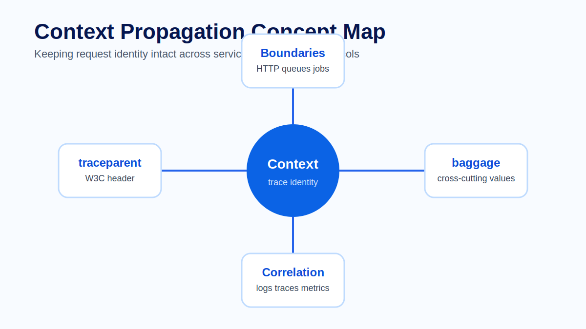
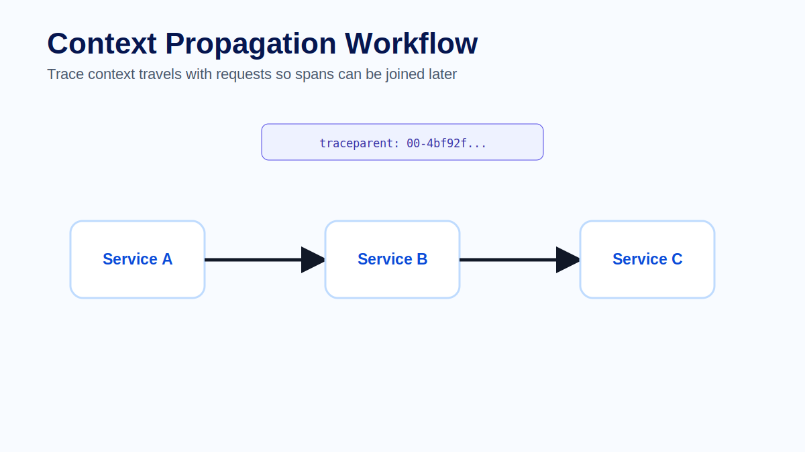
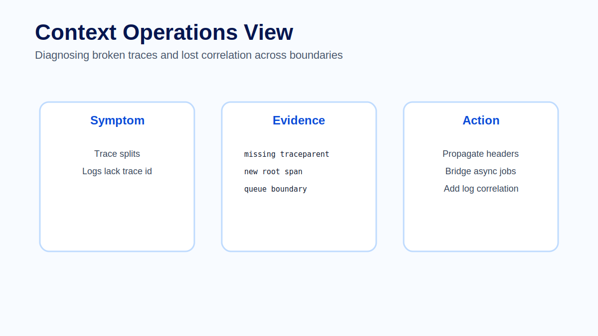

# Module 07 - Context Propagation

## Overview

Module 06 explained traces as request-level evidence. A trace is only useful as a distributed story when the services involved agree that they are handling the same logical request. Context propagation is the mechanism that carries that identity across process, service, protocol and asynchronous boundaries.

In production systems, broken propagation rarely breaks the application itself. The checkout still completes, the worker still consumes the message and the database still executes the query. What breaks is the investigation path. Instead of one trace that shows the complete journey, engineers see several disconnected root traces and must manually reconstruct the request from timestamps, log messages and assumptions.

This module teaches context propagation as an operational reliability capability, not only as a tracing implementation detail. Participants learn how trace identity moves, where it is commonly lost and how to validate propagation during incidents and platform reviews.



## Learning Objectives

After completing this module, participants will be able to:

- Explain why distributed tracing depends on context propagation.
- Describe the purpose of W3C Trace Context headers such as `traceparent` and `tracestate`.
- Explain how OpenTelemetry propagators inject and extract context.
- Distinguish trace context from baggage and explain baggage safety concerns.
- Identify common propagation breakpoints across HTTP, messaging, jobs, proxies and async execution.
- Diagnose fragmented traces by comparing expected request flow with observed trace roots.
- Define production checks that validate propagation across services and queues.

## Prerequisites

Participants should be familiar with:

- Trace anatomy, spans and trace ids from Module 06.
- OpenTelemetry SDK and Collector roles from Modules 02 and 03.
- Structured logging and trace id correlation from Module 04.
- Basic HTTP and message queue concepts.

## Module Structure

1. Why context propagation matters.
2. Trace context and request identity.
3. W3C Trace Context.
4. OpenTelemetry propagators.
5. Baggage and safety boundaries.
6. HTTP, messaging and asynchronous boundaries.
7. Diagnosing propagation failures.
8. Production validation patterns.
9. Hands-on practice.
10. Summary.

## 7.1 Why Context Propagation Matters

A trace id is the shared identifier that allows spans from different services to be grouped into one trace. A span id identifies one operation, and parent-child relationships describe causality. Context propagation ensures these identifiers move with the request.

Without propagation, each service may start its own trace. From the application perspective, the workflow succeeded. From the observability perspective, the story is fragmented.

> **Production Example**
>
> A user places an order. The API service calls the order service over HTTP, then publishes a message to a fulfillment queue. The API and order service appear in one trace, but fulfillment appears as a separate root trace. The incident team can see that fulfillment was slow, but cannot prove which user request caused the work. The issue is not missing telemetry volume; it is missing context at the queue boundary.

Context propagation is therefore part of production readiness. A service that emits spans but fails to propagate context can still make distributed tracing unreliable.

## 7.2 Trace Context and Request Identity

Trace context is the minimal information needed to continue a trace. When a service receives a request, it extracts context from the carrier, such as HTTP headers or message metadata. When that service calls another dependency, it injects the current context into the outgoing carrier.

The basic flow is:

1. Extract incoming context.
2. Start or continue the current span.
3. Make downstream calls while the span is active.
4. Inject context into outgoing requests or messages.
5. Downstream services extract that context and continue the trace.



The carrier changes by protocol. In HTTP, the carrier is usually headers. In messaging, it is message attributes or metadata. In some legacy systems, teams may need adapters that translate context into an approved metadata format.

> **Architect Note**
>
> Propagation is a contract between services. It is not enough for one service to emit spans. Every boundary in the request path must preserve the context contract, otherwise the trace will split at the weakest link.

## 7.3 W3C Trace Context

The W3C Trace Context standard defines a common way to propagate trace identity across systems. The most important header is `traceparent`.

A `traceparent` value contains version, trace id, parent span id and trace flags. A simplified example looks like this:

```text
traceparent: 00-4bf92f3577b34da6a3ce929d0e0e4736-00f067aa0ba902b7-01
```

| Field | Purpose |
|---|---|
| Version | Format version for the header. |
| Trace id | Identifies the complete distributed trace. |
| Parent span id | Identifies the upstream span that caused the current work. |
| Trace flags | Carries options such as whether the trace is sampled. |

The companion `tracestate` header allows vendors or platforms to carry additional trace-system-specific state. Teams should treat it as propagation metadata, not as a place for business payloads.

> **Best Practice**
>
> Prefer the standard W3C Trace Context format unless a legacy dependency requires another format. Standard propagation improves interoperability between services, libraries, gateways, proxies and observability backends.

## 7.4 OpenTelemetry Propagators

OpenTelemetry uses propagators to inject and extract context. A propagator knows how to read context from a carrier and how to write context into a carrier.

Automatic instrumentation often handles this for common frameworks and clients. For example, incoming HTTP server instrumentation can extract context from request headers, while outgoing HTTP client instrumentation can inject context into downstream requests.

Manual propagation may still be required when:

- using custom HTTP clients;
- publishing messages with custom producers;
- consuming messages outside a supported framework;
- crossing process boundaries through files, jobs or scheduled tasks;
- using internal protocols that do not look like HTTP or standard messaging;
- creating manual threads or tasks where execution context is not automatically preserved.

A useful implementation review asks two questions for every boundary:

1. Is context injected before the outgoing call or message is created?
2. Is context extracted before the downstream span is started?

If either answer is no, the trace may split.

## 7.5 Baggage and Safety Boundaries

Baggage is a mechanism for propagating key-value pairs alongside trace context. It can be useful for low-cardinality, non-sensitive context that must be available across services, such as a safe tenant tier, region or feature flag.

Baggage is not the same as span attributes. Span attributes describe an operation and are recorded with telemetry. Baggage travels with the request and can reach many services.

Because baggage propagates widely, it creates safety and cost concerns:

- It must not contain secrets, tokens or personal data.
- It should remain small.
- It should use bounded values.
- It should not become a hidden business payload transport.
- It should be reviewed like an API contract.

> **Common Mistake**
>
> A team adds `customer_email` and raw order identifiers to baggage because it makes debugging easier. The values then propagate to unrelated services and appear in logs and telemetry. The safer design is to use bounded, non-sensitive identifiers or derive investigation context in the backend where access controls exist.

## 7.6 HTTP, Messaging and Asynchronous Boundaries

HTTP propagation is the easiest case to visualize because headers move directly with the request. Messaging is more subtle. A producer may publish a message now, and a consumer may process it later. If context is not written to message metadata, the consumer has no way to know which upstream trace caused the message.

Asynchronous systems also change the meaning of parent-child relationships. In some cases, a consumer span is a child of the producer span. In other cases, a span link may better represent that the consumer work is related but not strictly part of the same synchronous call stack.

Important boundaries include:

| Boundary | Propagation risk | What to check |
|---|---|---|
| HTTP client to downstream API | Headers not injected | Outgoing request contains `traceparent`. |
| API gateway or reverse proxy | Headers stripped or rewritten | Gateway forwards trace headers. |
| Message producer to queue | Metadata not written | Message attributes contain trace context. |
| Queue to consumer | Metadata ignored | Consumer extracts before starting processing span. |
| Background job | No incoming request | Job creates a clear root span or links to triggering context. |
| Manual thread/task | Execution context lost | Runtime context is explicitly preserved or restored. |
| Legacy protocol | No standard carrier | Adapter maps trace context to approved metadata. |

> **Architect Note**
>
> Not every background operation must continue a user request trace. The important design decision is intentionality: either preserve context, create a clean new root trace, or link related traces. Accidental fragmentation is the problem.

## 7.7 Diagnosing Propagation Failures

Broken propagation often appears as an observability symptom rather than an application error. Common signs include:

- unexpected new root spans in downstream services;
- missing parent spans;
- traces that stop at a gateway, queue or worker;
- logs with different trace ids for the same business operation;
- service maps showing dependencies but traces not showing the same relationship;
- incident timelines that require manual timestamp matching.



A practical diagnostic method is:

1. Draw the expected request path.
2. Open the trace for a known request.
3. Identify the last span before the trace disappears.
4. Check the outgoing carrier at that boundary.
5. Check whether the downstream service extracted the context.
6. Compare trace ids in logs on both sides.
7. Fix injection, extraction or gateway forwarding.
8. Re-run the request and confirm one connected trace or an intentional span link.

> **Best Practice**
>
> Treat propagation validation as part of service onboarding. A service is not fully observable just because it emits spans. It should also preserve trace identity across every dependency it calls.

## 7.8 Production Validation Patterns

Production teams should validate propagation before incidents. Useful validation patterns include:

- synthetic requests that traverse known service paths;
- trace review during release readiness;
- queue propagation checks in integration tests;
- log correlation checks that verify consistent trace ids across services;
- gateway configuration reviews for allowed propagation headers;
- dashboards or queries that detect unusual increases in root spans by service;
- sampling checks to ensure propagation failures are not hidden by retention policy.

A simple operational query pattern is to count root spans by service over time. A sudden increase in root spans for a downstream service may indicate propagation was broken after a deployment or gateway change.

## Hands-on Practice

The learner-facing practice material for this module is kept in dedicated files so it can be reused in workshops, self-study and slide delivery:

- [Exercise - Propagation break analysis](exercise.md)
- [Lab - Context propagation across HTTP and messaging boundaries](../../labs/module-07-context-propagation-boundaries.md)
- [Quiz - Review questions and answers](quiz.md)
- [Official references](references.md)
- [Editable Mermaid diagram](../../diagrams/module-07-context-propagation-flow.mmd)

## Common Interview Questions

1. Why does distributed tracing depend on context propagation?
2. What information does the `traceparent` header carry?
3. What is the difference between extracting and injecting context?
4. Where is context commonly lost in asynchronous systems?
5. When would baggage be useful, and what should never be placed in baggage?
6. How would you diagnose a trace that splits after a queue boundary?
7. What role can gateways or proxies play in propagation failures?
8. How can logs help confirm whether propagation is working?
9. When might a span link be more appropriate than a parent-child relationship?
10. What checks would you include before declaring a service production-ready for tracing?

## Summary

Context propagation keeps distributed traces connected. It carries trace identity across service and protocol boundaries so spans from different processes can be assembled into one request story. The W3C Trace Context standard provides interoperable HTTP headers, while OpenTelemetry propagators inject and extract context from carriers.

The operational challenge is not only enabling propagation in one service. It is preserving the propagation contract across gateways, clients, queues, workers, jobs and legacy protocols. Baggage can carry additional key-value context, but it must be handled carefully because it travels broadly.

A mature observability platform validates propagation continuously. It checks that traces remain connected, that logs carry consistent trace ids and that asynchronous boundaries either preserve context or intentionally create new roots or links.

## Key Takeaways

- Context propagation is the mechanism that keeps distributed traces connected.
- W3C Trace Context defines standard headers such as `traceparent`.
- OpenTelemetry propagators inject context into outgoing carriers and extract context from incoming carriers.
- HTTP propagation is usually header-based; messaging propagation requires metadata support.
- Baggage is powerful but risky and must never carry secrets or personal data.
- Broken propagation usually causes investigation problems, not application failures.
- Root-span spikes, trace splits and inconsistent log trace ids are common diagnostic signals.
- Production readiness should include propagation validation across every service boundary.

## Next Module

Module 08 focuses on instrumentation: how automatic and manual instrumentation create useful telemetry while balancing coverage, cost and maintainability.