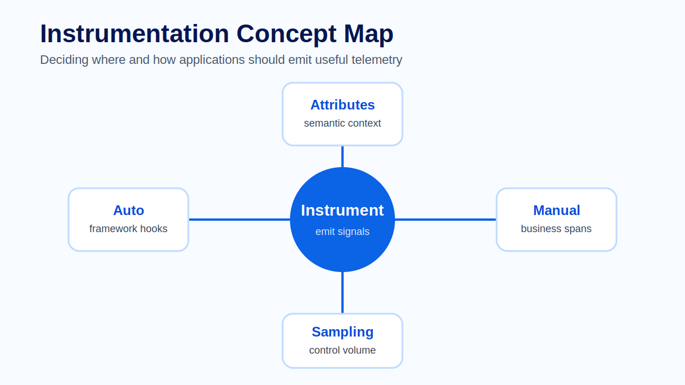
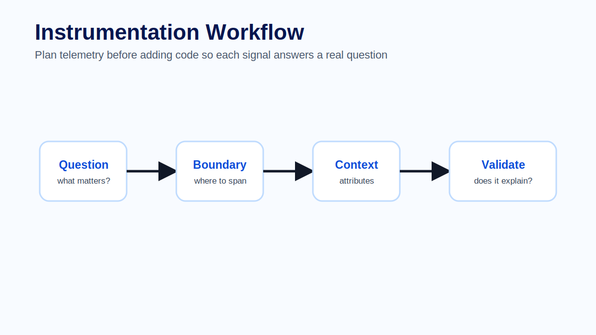
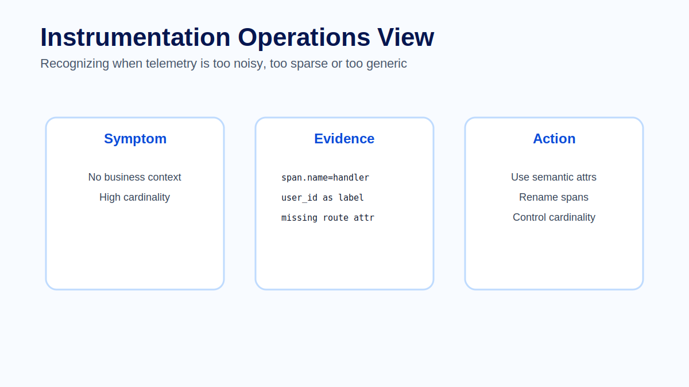

# Module 08 - Instrumentation

## Course context

Instrumentation is the engineering practice of making software explain itself while it is running. It is the point where observability stops being only a platform concern and becomes part of application design.

A production incident rarely starts with a clean technical question. It usually starts with a symptom: a screen is slow, a job missed its window, an integration is timing out, or a customer operation failed without an obvious error. If the application was not instrumented around the right boundaries, the team must guess. If it was instrumented well, the telemetry tells an investigation story.

The most important instrumentation question is not `what can we collect?` It is:

> What will an engineer need to know when this operation fails in production?



By the end of this module, learners should be able to design telemetry for a business operation, combine automatic and manual instrumentation, choose safe attributes, and review whether the resulting telemetry is useful for operations.

## Learning objectives

After completing this module, learners should be able to:

- explain the difference between automatic and manual instrumentation;
- identify the boundaries where custom spans add operational value;
- choose metrics, traces and logs based on the question being answered;
- apply semantic conventions and safe attribute design;
- avoid high-cardinality, sensitive or misleading telemetry;
- review instrumentation after deployment using real traces, dashboards and logs.

## Why instrumentation exists

Observability platforms cannot infer business meaning by themselves. They can receive telemetry, store it, query it and visualize it, but they cannot automatically know that `POST /api/order/validate` represents a manufacturing order release, a payment authorization, or a critical customer workflow.

Automatic instrumentation can show that an HTTP request happened, which database query ran and how long an external dependency took. That is necessary, but it is not always sufficient. During an incident, the team often needs to know which business operation was being executed, which decision point failed, and which dependency changed the outcome.

Instrumentation exists to close that gap.

### Production example

A manufacturing order validation request takes 45 seconds. The automatically generated trace shows an inbound HTTP span and several database calls. None of the database calls is individually slow. Without manual spans, the trace looks like generic application time.

After adding manual instrumentation, the trace shows three business steps:

1. `manufacturing_order.load_context`
2. `manufacturing_order.validate_material_availability`
3. `manufacturing_order.request_erp_confirmation`

The third span accounts for most of the duration and contains a safe attribute indicating the dependency type: `dependency.system = erp`. The investigation shifts from database tuning to ERP dependency analysis.

This is good instrumentation because it changes the engineering decision.

## Automatic instrumentation

Automatic instrumentation provides a fast baseline. Depending on the language and framework, it can create telemetry for inbound HTTP requests, outgoing HTTP calls, database clients, messaging libraries, runtime metrics and exceptions.

Automatic instrumentation is valuable because it gives broad coverage quickly and consistently. It is often the first layer teams enable when introducing OpenTelemetry.

However, automatic instrumentation has limits:

- it usually sees technical operations, not business intent;
- it may produce generic span names if routes or handlers are not resolved correctly;
- it cannot decide which attributes are safe or meaningful for a specific domain;
- it may create too much telemetry if enabled without sampling, filtering or review;
- it may miss internal decision points that are not represented by framework calls.

### Architect note

Automatic instrumentation should be treated as the foundation, not the final design. It gives the skeleton of the execution path. Manual instrumentation adds the muscles and nerves: the business decisions, dependency boundaries and operational context that help humans investigate.

## Manual instrumentation

Manual instrumentation is custom telemetry added by engineers. It can create spans, metrics and logs at meaningful points in the application.

Manual instrumentation should be used when the code crosses a boundary that matters in production. Good candidates include:

- critical business operations;
- long-running jobs;
- external dependencies;
- queue publish and consume operations;
- retry loops and fallback logic;
- validation and decision points;
- batch processing stages;
- cache lookups where hit ratio matters;
- security or authorization decisions, without exposing sensitive data.



### Span design

A span should represent a meaningful unit of work. The name should be stable, readable and useful in a trace waterfall.

Prefer names such as:

```text
checkout.authorize_payment
inventory.reserve_stock
manufacturing_order.validate
integration.erp.send_request
report.generate_monthly_summary
```

Avoid names such as:

```text
DoWork
Handle
Execute
MyService.ProcessAsync
lambda_handler
```

Implementation details change frequently. Operational concepts should remain stable.

### Attribute design

Attributes should explain the operation safely. Use OpenTelemetry semantic conventions where they exist, and define local conventions where the domain requires them.

Good attributes are:

- safe to store;
- stable enough to query;
- low-cardinality when used on metrics;
- aligned with naming conventions;
- useful during an incident.

Examples:

```text
service.name = checkout-api
deployment.environment = production
http.route = /api/orders/{id}/authorize
business.operation = checkout.authorize_payment
dependency.system = payment_gateway
messaging.operation.type = publish
job.name = nightly_history_cleanup
```

Risky attributes include raw payloads, email addresses, user ids, session ids, access tokens, full URLs with query strings, SQL statements containing values, or customer-specific identifiers.

### Metrics, traces and logs

Instrumentation should not emit every signal for every detail. Choose the signal based on the question.

| Question | Best signal | Example |
|---|---|---|
| Is the operation getting slower over time? | Metric | `checkout_authorization_duration` histogram |
| Which step consumed the request time? | Trace | Span breakdown of validation, dependency calls and persistence |
| What exact error occurred? | Log | Structured error event with `trace_id` and safe fields |
| Should we alert? | Metric | Error rate or latency SLO burn rate |
| Which dependency caused this request to fail? | Trace + log | Dependency span and correlated exception log |

A strong instrumentation design makes these signals reinforce each other. Metrics detect the symptom, traces explain the flow, and logs provide detailed event evidence.

## Designing instrumentation from production questions

A practical design process starts with questions, not code.

1. Identify the business operation.
2. Define the failure modes.
3. Define the questions an operator would ask during an incident.
4. Choose the signal that answers each question.
5. Select safe attributes and controlled labels.
6. Validate the result in a real trace, dashboard and log query.

### Example design table

| Production question | Instrumentation decision |
|---|---|
| How often does order validation fail? | Metric counter with labels for result and failure category |
| Which validation stage is slow? | Manual spans for each major validation stage |
| Is the failure caused by ERP, database or application logic? | Dependency spans with `dependency.system` and safe error classification |
| Which trace should support investigation? | Correlate logs with trace id and span id |
| Is the metric safe to aggregate? | Avoid order id, user id or customer id as metric labels |

## Cardinality and cost

Cardinality is one of the most important production instrumentation concerns. A label or attribute has high cardinality when it can take many unique values. Metrics are especially sensitive to cardinality because each unique label combination creates a separate time series.

High-cardinality metric labels can increase storage cost, slow queries and make dashboards difficult to use. Examples include user ids, session ids, request ids, order ids, trace ids and raw URLs.

Traces and logs can carry more detailed context, but the same safety rules still apply. High-cardinality data may be acceptable in traces when it is safe and intentionally retained for investigation, but it should not be copied blindly into metrics.

### Best practice

Use controlled labels for metrics and richer context in traces or logs when needed.

For example:

```text
Good metric labels:
operation = checkout_authorization
result = success | failure
failure_category = timeout | validation | dependency | unknown

Avoid metric labels:
user_id = 81273612
order_id = ORD-2026-0000009182
request_id = 9f4b...
url = /api/orders/ORD-2026-0000009182/authorize?customer=...
```

## Security and privacy

Instrumentation can accidentally become a data leak. Teams must design telemetry under the assumption that it will be stored, queried, exported, retained and viewed by multiple audiences.

Do not collect:

- passwords, tokens or secrets;
- personal data unless explicitly approved;
- raw request or response bodies;
- full URLs containing query parameters;
- customer names or tenant identifiers where anonymization is required;
- SQL statements with sensitive values;
- business documents or payload fragments.

When business context is necessary, prefer classification over identity.

Example:

```text
Prefer: customer.tier = enterprise
Avoid: customer.name = Example Manufacturing Ltd

Prefer: failure.category = external_dependency_timeout
Avoid: error.details = full payload from failed ERP request
```

## Instrumentation review after deployment

Instrumentation should be reviewed like production code. A design that looks useful in a pull request may produce noisy, expensive or incomplete telemetry after deployment.

Review the telemetry with real data:

- Does the trace show the business flow clearly?
- Are span names stable and readable?
- Can the team filter by service, environment and operation?
- Do metrics have controlled labels?
- Are logs correlated with traces?
- Are attributes safe?
- Are dashboards and alerts based on meaningful signals?
- Did the instrumentation increase cost or ingestion volume unexpectedly?



### Production review example

After deployment, a team notices that `http.route` contains raw IDs for one endpoint because the framework did not resolve the route template. The dashboard now shows thousands of routes instead of one logical route.

The fix is not to add more dashboards. The fix is to correct instrumentation so the route is normalized:

```text
Bad:  /api/orders/123456/authorize
Good: /api/orders/{orderId}/authorize
```

This is a common example of telemetry quality directly affecting operational usability.

## Common mistakes

### Relying only on automatic instrumentation

Automatic spans show technical flow, but they often miss domain meaning. Add manual spans at important business and dependency boundaries.

### Naming spans after code structure

Names such as `OrderService.ProcessAsync` are less useful than `order.validate` or `order.reserve_inventory`. Code structure changes; operational concepts should remain stable.

### Using high-cardinality metric labels

Unique identifiers should not become metric labels. Use traces and logs for per-request investigation details.

### Logging sensitive data

Telemetry is not a safe place for raw payloads, tokens, credentials or personal data. Redact, classify or omit sensitive fields.

### Creating telemetry without ownership

Every important metric, dashboard, alert and custom span should have an owner. Unowned telemetry becomes noise.

### Instrumenting everything equally

More telemetry is not automatically better. Prioritize critical paths, failure-prone dependencies and questions that engineers actually ask during incidents.

## Hands-on practice

Use the companion lab to design and validate instrumentation for a checkout-style operation. The lab intentionally asks learners to decide what not to collect, because safe omission is part of good telemetry design.

## Interview and review questions

1. When is automatic instrumentation enough, and when is manual instrumentation required?
2. What makes a span name operationally useful?
3. Why are semantic conventions important?
4. Why are high-cardinality metric labels risky?
5. What information should never be collected in telemetry?
6. How would you review instrumentation after deployment?
7. How can logs, metrics and traces support the same investigation?
8. What is the difference between a useful business attribute and a sensitive identifier?

## Key takeaways

- Instrumentation should answer production questions.
- Automatic instrumentation provides coverage; manual instrumentation provides business meaning.
- Spans should represent meaningful units of work with stable names.
- Attributes must be safe, consistent and useful.
- Metrics require controlled labels and careful cardinality management.
- Logs, metrics and traces should be designed as correlated evidence.
- Instrumentation must be reviewed after deployment using real telemetry.

## Official references

- OpenTelemetry Instrumentation: https://opentelemetry.io/docs/concepts/instrumentation/
- OpenTelemetry Semantic Conventions: https://opentelemetry.io/docs/specs/semconv/
- OpenTelemetry Language SDKs: https://opentelemetry.io/docs/languages/
- OpenTelemetry Traces: https://opentelemetry.io/docs/concepts/signals/traces/
- OpenTelemetry Metrics: https://opentelemetry.io/docs/concepts/signals/metrics/
- OpenTelemetry Logs: https://opentelemetry.io/docs/concepts/signals/logs/
