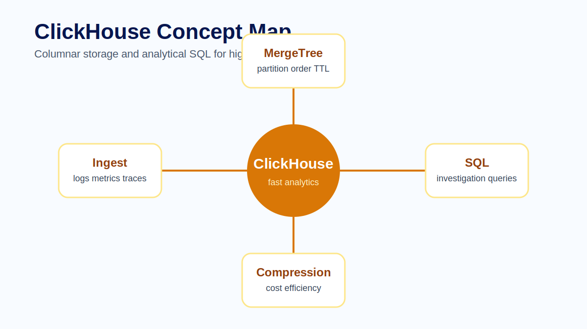
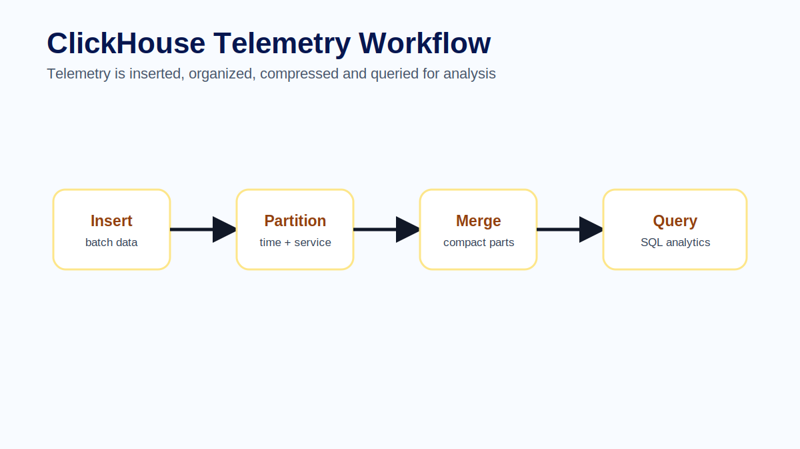
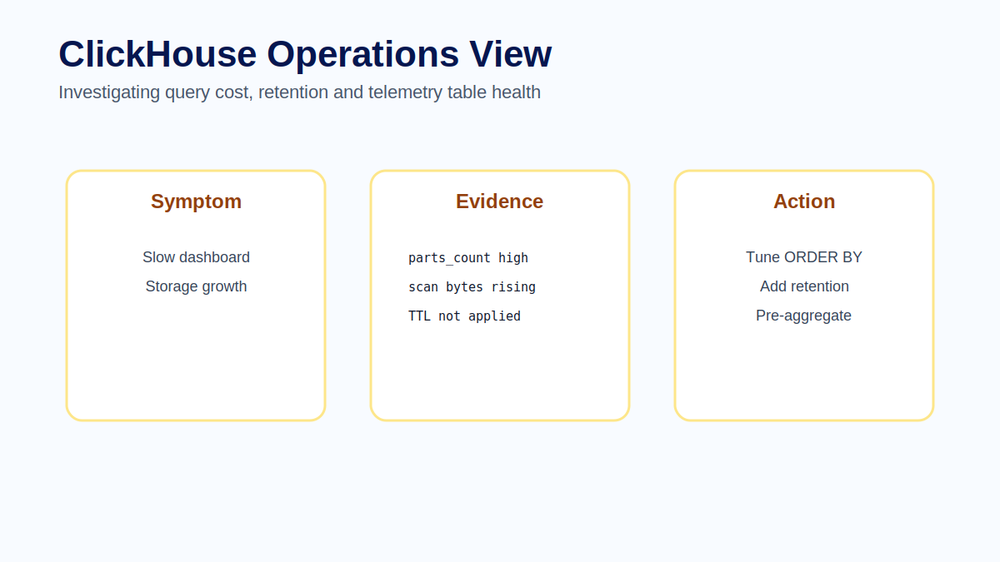

# Module 09 - ClickHouse

## Overview

Modules 03 through 06 showed how telemetry is collected and how logs, metrics and traces support investigations. This module focuses on the storage and query layer: ClickHouse.

Observability data can be large, repetitive and highly analytical. Logs, metrics and traces often produce many rows that are queried by time range, service, environment, severity, route or trace id. ClickHouse is designed for this kind of workload: fast analytical queries over large datasets.

ClickHouse is a columnar database. Instead of storing rows as the primary physical unit, it stores data by columns. This is useful for observability because many queries scan a few columns across many records, such as timestamp, service name, duration and status.



## Learning Objectives

After completing this module, participants will be able to:

- Explain why ClickHouse fits analytical telemetry workloads.
- Describe how columnar storage benefits common observability queries.
- Explain how Collector ingestion, ClickHouse tables and query tools fit together.
- Design schema choices around investigation patterns.
- Explain why batching, ordering, partitioning and retention affect operational performance.
- Use SQL to investigate traces, logs and metrics stored in ClickHouse.
- Identify common ClickHouse mistakes in telemetry platforms.

## Prerequisites

Participants should be familiar with:

- Logs, metrics and traces.
- OpenTelemetry Collector pipelines.
- Basic SQL filtering, grouping and ordering.
- Basic time-series investigation concepts.
- The shared Docker Compose lab environment used by the course.

## Module Structure

1. Why ClickHouse fits telemetry.
2. Architecture.
3. Columnar storage.
4. Schema design.
5. Ingestion and batching.
6. Retention and cost.
7. SQL investigation patterns.
8. Common mistakes.
9. Hands-on practice.
10. Summary.

## 9.1 Why ClickHouse Fits Telemetry

Telemetry queries are usually analytical. Engineers ask how many errors happened per service, which route has the highest p95 latency, which traces exceeded a duration threshold or how log volume changed after a deployment. These queries benefit from compression, column pruning and efficient aggregation.

ClickHouse also supports SQL, which makes investigation approachable. Engineers can filter, group and aggregate telemetry without learning a proprietary query language for every task.

ClickHouse should be understood as storage and query infrastructure. It is not the source of telemetry and it is not a dashboard. Applications and Collectors produce telemetry. ClickHouse stores it efficiently. SQL, Grafana and other tools make that data useful for investigation.

> **Architect Note**
>
> ClickHouse works well for observability when schema, ingestion and queries are designed together. A powerful database cannot rescue a telemetry platform that inserts inefficiently, keeps every raw event forever or uses schemas that do not match investigation paths.

## 9.2 Architecture

A typical OpenTelemetry and ClickHouse flow looks like this:

```text
Applications
    -> OpenTelemetry SDKs or agents
    -> OpenTelemetry Collector
    -> ClickHouse exporter
    -> ClickHouse tables
    -> SQL workbooks, Grafana dashboards and ad hoc investigations
```

The Collector is responsible for receiving and exporting telemetry. ClickHouse is responsible for storing and querying it. Grafana or SQL clients are responsible for presenting and exploring it.



> **Production Example**
>
> A platform team exports checkout traces, structured logs and selected metrics from the Collector to ClickHouse. During an incident, a Grafana panel shows p95 checkout latency increased. An engineer queries ClickHouse for the slowest spans, filters by `ServiceName='checkout-api'`, finds a trace id, and then queries related logs by the same trace id. ClickHouse becomes the investigation surface that connects telemetry signals through consistent fields.

## 9.3 Columnar Storage

Columnar storage means ClickHouse can read only the columns needed by a query. This matters because observability queries often scan many rows but only a few fields.

For example, a query that counts errors by service may need timestamp, service name and status. It does not need every log body, span attribute or metric value. Column pruning and compression make this pattern efficient.

Columnar storage is strongest when queries aggregate or filter across large datasets. It is not a reason to ignore schema design. The columns, order key and partitioning still need to match the way people investigate production issues.

## 9.4 Schema Design

Good schema design matters. Time is usually central, so partitioning and ordering should support time-range queries. Service name, environment, trace id and severity are common filter fields. The right order key depends on the query patterns.

A poor schema can make dashboards slow even if the database is powerful. A good schema aligns with how engineers investigate incidents.

Useful schema questions include:

- What time column will most queries filter on?
- Which fields identify service, environment and deployment?
- Which fields support trace lookup?
- Which fields support dashboard grouping?
- Which attributes are safe and stable enough to store or index?
- Which fields are too high-cardinality for common filters?

A trace-span table might prioritize time, service and trace lookup. A log table might prioritize time, service, severity and trace id. A metric table might prioritize metric name, time and bounded labels.

> **Best Practice**
>
> Design ClickHouse schemas from investigation queries backward. Start with the questions engineers will ask during incidents, then choose columns, order keys and retention policies that make those questions fast and affordable.

## 9.5 Ingestion and Batching

Telemetry should be inserted efficiently, usually in batches. Very small inserts can create too many parts and harm performance. The ingestion path should be designed with buffering, batching and backpressure in mind.

In an OpenTelemetry architecture, ingestion behavior is not only a ClickHouse concern. The Collector exporter, batching processors, retry behavior and queue limits all shape what ClickHouse receives.

Production ingestion design should answer:

- What batch size is appropriate for each signal?
- How does the Collector behave when ClickHouse is slow or unavailable?
- How much data loss is acceptable during outages?
- Are retries and queues bounded?
- Can operators see exporter failures and queue pressure?
- Are inserts shaped to avoid excessive part creation?

Batching improves throughput, but it can add latency. Large buffers can protect against short outages, but they require memory or persistent queue planning. The right design depends on the value of the telemetry and the failure modes the platform must tolerate.

## 9.6 Retention and Cost

Retention is an architectural decision. Raw logs may not need the same retention as aggregated metrics. Trace data for failed or slow requests may be more valuable than complete trace data for every successful request. ClickHouse TTL features can help enforce retention policies.

Retention should consider:

- incident investigation needs;
- compliance and audit requirements;
- storage cost;
- query performance;
- signal value over time;
- whether raw data can be summarized or downsampled.

Keeping all raw telemetry forever is rarely a responsible default. Some data is valuable for days. Some aggregates are valuable for months. Some audit records require specific retention and access controls.

> **Common Mistake**
>
> A team stores every raw log, span and metric sample with the same retention policy. Storage grows quickly, queries slow down and the most valuable telemetry is not distinguished from low-value noise. The better design is to set retention by signal, use case and compliance requirement, then document the trade-off.

## 9.7 SQL Investigation Patterns

Useful query patterns include error count by service, p95 latency by route, slowest traces in a time window and log records related to a trace id. These queries are most valuable when telemetry uses consistent field names.



Examples of investigation questions:

```sql
SELECT ServiceName, count() AS errors
FROM otel_traces
WHERE Timestamp >= now() - INTERVAL 1 HOUR
  AND StatusCode = 'STATUS_CODE_ERROR'
GROUP BY ServiceName
ORDER BY errors DESC;
```

```sql
SELECT TraceId, SpanName, ServiceName, Duration, StatusCode
FROM otel_traces
WHERE Timestamp >= now() - INTERVAL 1 HOUR
ORDER BY Duration DESC
LIMIT 20;
```

```sql
SELECT Timestamp, SeverityText, Body
FROM otel_logs
WHERE TraceId = '4bf92f3577b34da6a3ce929d0e0e4736'
ORDER BY Timestamp ASC;
```

These examples are intentionally simple. Production queries should use the actual schema, time column, status representation and indexes used by the deployed exporter. The lab workbook contains reusable examples for the course environment.

## 9.8 Common Mistakes

Common mistakes include inserting too many tiny batches, using order keys that do not match query patterns, retaining all raw telemetry forever and allowing uncontrolled high-cardinality fields to dominate storage.

Additional mistakes include:

- Treating ClickHouse as the telemetry pipeline instead of storage and query infrastructure.
- Designing tables before understanding incident queries.
- Ignoring Collector exporter failure metrics.
- Letting dashboards run expensive unbounded time-range queries.
- Storing sensitive raw payloads without access and retention controls.
- Assuming SQL flexibility removes the need for naming conventions.
- Using one retention policy for all signals and environments.

A good ClickHouse observability design makes the common investigation path fast, predictable and affordable.

## Hands-on Practice

The learner-facing practice material for this module is kept in dedicated files so it can be reused in workshops, self-study and slide delivery:

- [Exercise - Trace span table design](exercise.md)
- [Lab - ClickHouse observability query workbook](../../labs/module-09-clickhouse-query-workbook.md)
- [Quiz - Review questions and answers](quiz.md)
- [Official references](references.md)

## Common Interview Questions

1. Why is columnar storage useful for telemetry workloads?
2. How should schema design follow investigation patterns?
3. Why can tiny inserts harm ClickHouse performance?
4. What does an order key influence in observability queries?
5. Why should retention differ by signal, environment or use case?
6. How does the OpenTelemetry Collector affect ClickHouse ingestion behavior?
7. What query would you write to find logs related to a trace id?
8. Why is ClickHouse storage infrastructure rather than the observability source?

## Summary

ClickHouse is well suited to analytical telemetry workloads because it can query large datasets efficiently, especially when schemas and query patterns are designed together. It gives teams a flexible SQL investigation surface for logs, metrics and traces stored by the telemetry pipeline.

In this module we covered columnar storage, Collector-to-ClickHouse architecture, schema design, ingestion, batching, retention, cost and SQL investigation patterns. The next module focuses on Grafana, where telemetry stored in systems like ClickHouse becomes dashboards, exploration workflows and alerts.

## Key Takeaways

- ClickHouse fits telemetry because observability queries are analytical and time-oriented.
- Schema design should start from investigation questions.
- Batching and backpressure are production ingestion requirements.
- Retention should vary by signal value, cost and compliance requirement.
- SQL makes telemetry exploration flexible, but consistent field names still matter.
- ClickHouse is storage and query infrastructure, not the source of observability.

## Next Module

Module 10 focuses on Grafana: connecting data sources, exploring telemetry, building dashboards and turning stored signals into operational insight.
