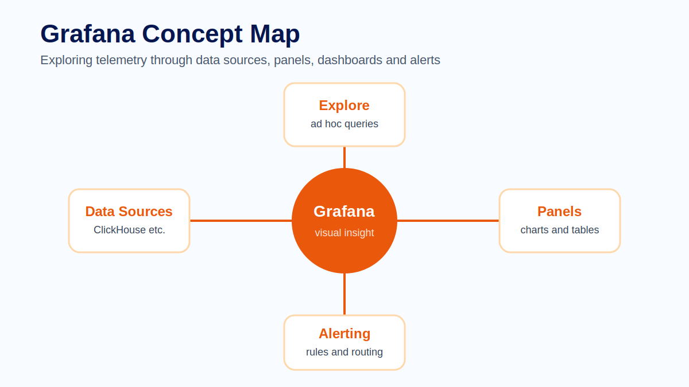
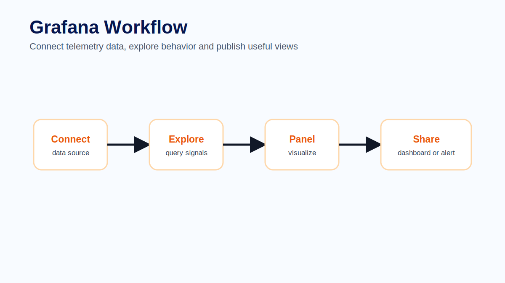
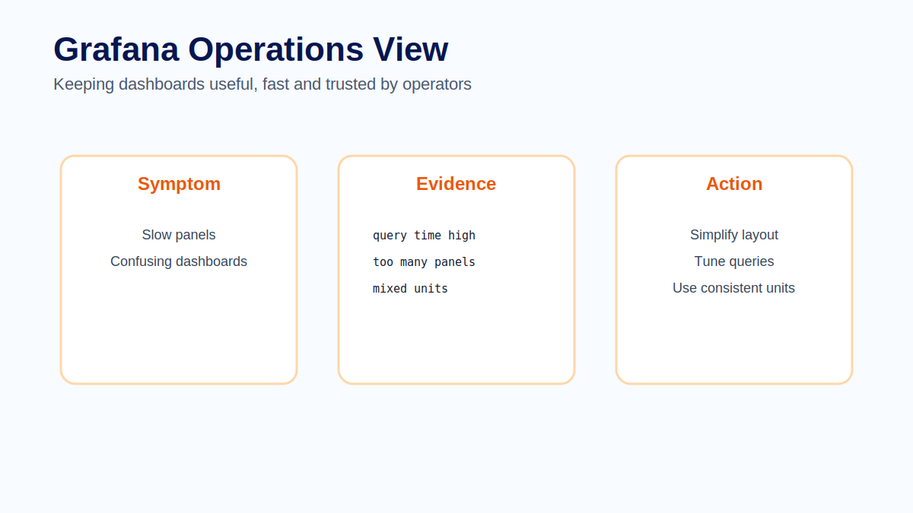

# Module 10 - Grafana

## Course context

Grafana is often the place where telemetry becomes visible to engineers, operators and stakeholders. It connects to data sources, lets users explore data, builds dashboards and supports alerting workflows. In an observability platform, Grafana is the interface where many investigations begin.

A visualization layer should not simply display data. It should help people answer operational questions. A good Grafana setup makes it easy to move from a symptom to evidence and from evidence to action.

## Data sources and Explore

Grafana works with data sources. A data source may represent ClickHouse, Prometheus, Loki, Tempo or another backend. Each data source has its own query model, but Grafana provides a consistent user experience for querying and visualizing results.

Explore is useful during investigation. It allows engineers to query interactively, adjust time ranges and inspect raw data before turning a query into a dashboard panel.

## Panels and dashboards

Panels are visualizations: time series, tables, stats, gauges, heatmaps and more. A dashboard is a collection of panels organized around a purpose. The best dashboards answer specific questions rather than showing every available metric.

A useful dashboard should have a clear audience. An executive service health dashboard, an on-call troubleshooting dashboard and a developer debugging dashboard should not all look the same.

## Building useful visualizations

Choose visualization types based on the question. Use time series for trends, tables for detailed records, stat panels for current values and heatmaps for distributions. Units, thresholds and legends should be consistent.

If a panel cannot explain what decision it supports, it probably needs to be changed or removed.

## Performance and trust

Slow dashboards reduce trust. Query design, time range, panel count and data source performance all matter. A dashboard that takes too long to load will not be used during an incident.

Trust also depends on correctness. Panels should use consistent units, documented filters and clear titles. Ambiguous panels create arguments instead of insight.

## Common mistakes

Common mistakes include putting too many panels on one screen, mixing unrelated audiences, using unclear units, hiding important filters and building dashboards before understanding the operational question.

## Exercise

Create a Grafana dashboard plan for a checkout service. Define three panels: request rate, p95 latency and error rate. For each panel, specify the data source, query intent, unit and what action an operator should take if it looks abnormal.

## Quiz

1. What is the role of a Grafana data source?
2. When is Explore useful?
3. Why should dashboards have a clear audience?
4. What makes a visualization trustworthy?
5. Why can too many panels harm incident response?

## Key takeaways

- Grafana turns telemetry into exploration, dashboards and alerts.
- Panels should answer operational questions.
- Dashboard performance affects trust during incidents.
- Good visualization design starts with audience and decision.

## Official references

- Grafana Documentation: https://grafana.com/docs/grafana/latest/
- Grafana Panels and Visualizations: https://grafana.com/docs/grafana/latest/panels-visualizations/
- Grafana Explore: https://grafana.com/docs/grafana/latest/explore/
- Grafana Data Sources: https://grafana.com/docs/grafana/latest/datasources/
