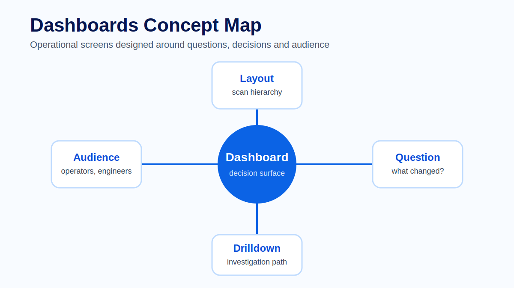
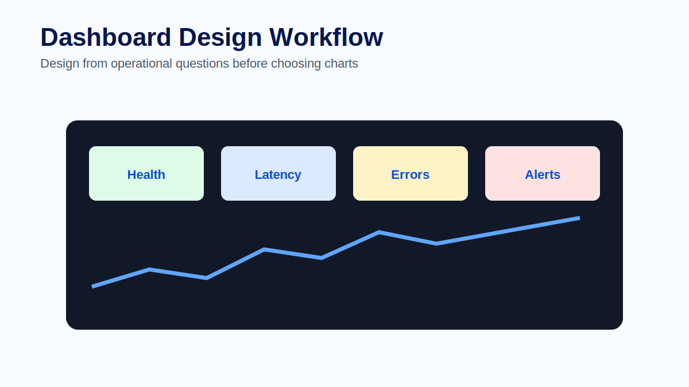
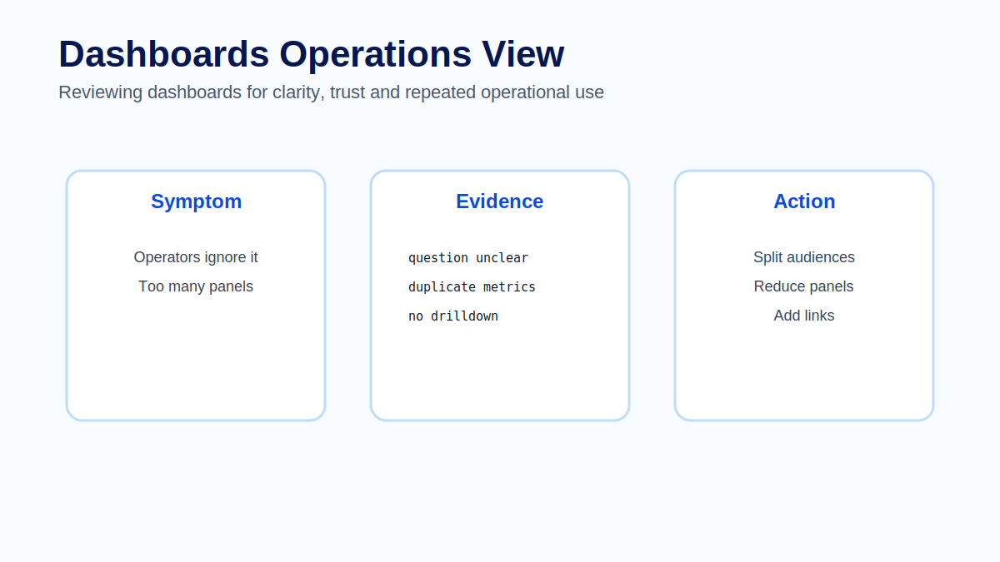

# Module 11 - Dashboards

## Overview

Module 10 introduced Grafana as the exploration, dashboard and alerting interface over telemetry data sources. This module goes deeper into dashboard design.

Dashboards are decision surfaces. They help people understand whether a service is healthy, whether an incident is spreading, whether a fix worked or whether a system is approaching capacity limits. A dashboard is not useful because it has many panels. It is useful because it helps the right audience answer the right questions quickly.

In observability training, dashboard design is where telemetry becomes operational communication.



## Learning Objectives

After completing this module, participants will be able to:

- Explain dashboards as operational decision surfaces.
- Design dashboards around audience and operational questions.
- Organize layout and hierarchy for fast incident scanning.
- Use variables, filters and drilldowns without hiding important context.
- Explain how dashboard ownership and review cadence affect trust.
- Identify dashboard performance and maintenance risks.
- Recognize common dashboard mistakes and safer alternatives.

## Prerequisites

Participants should be familiar with:

- Logs, metrics and traces.
- Grafana data sources, Explore and panels from Module 10.
- Basic service health indicators such as traffic, errors, latency and saturation.
- Basic incident response workflows.
- The ClickHouse-backed dashboard examples used earlier in the course.

## Module Structure

1. Why dashboards matter.
2. Start with the audience.
3. Dashboard architecture.
4. Layout and hierarchy.
5. From dashboards to investigation.
6. Ownership and lifecycle.
7. Performance and trust.
8. Common dashboard problems.
9. Hands-on practice.
10. Summary.

## 11.1 Why Dashboards Matter

Dashboards are often the first place people look during an incident. A good dashboard reduces uncertainty. It shows what changed, how severe the change is, where the impact appears and what evidence to inspect next.

A poor dashboard increases uncertainty. It may contain many panels but no clear story. It may mix different audiences, hide important filters or use expensive queries that fail when the system is already under stress.

> **Architect Note**
>
> A dashboard is part of the operational system. It should be designed, owned and reviewed like any other production asset. If a dashboard is used during incidents, its correctness and performance matter.

## 11.2 Start with the Audience

A dashboard should have a primary audience. On-call engineers need fast symptom recognition and drilldowns. Developers may need detailed service internals. Managers may need reliability trends and customer impact. Mixing all of these needs into one dashboard often produces a crowded screen that serves nobody well.

Start by writing the questions the dashboard must answer. For example:

- Is checkout healthy?
- Which dependency is slow?
- Did the latest deployment increase errors?
- Are we within the SLO budget?
- Which customer-facing route is most affected?

The audience determines the level of detail. An on-call dashboard should prioritize immediate health and investigation paths. A review dashboard may show trends, error budget and capacity. A developer dashboard may include more internals, but it should still answer explicit questions.

> **Production Example**
>
> A checkout service has three dashboards. The on-call dashboard shows traffic, error rate, p95 latency, saturation and recent slow or failed traces. The engineering dashboard adds dependency panels, deployment markers and route-level breakdowns. The leadership dashboard shows SLO status and customer-impact trends. Each dashboard has a different audience and therefore a different design.

## 11.3 Dashboard Architecture

A dashboard is built from several connected pieces:

```text
Telemetry backend
    -> data source
    -> query
    -> panel
    -> dashboard layout
    -> variables and links
    -> investigation workflow
```

The query defines the evidence. The panel turns evidence into a visual form. The dashboard organizes panels around a purpose. Variables and links let the user filter context or move deeper into traces, logs, services or detailed queries.

This architecture means dashboard quality depends on more than Grafana layout. It depends on telemetry naming, data-source performance, query correctness, units, thresholds and ownership.

## 11.4 Layout and Hierarchy

The most important information should be visible first. Health, traffic, errors and latency often belong near the top. Detailed panels and drilldowns can follow. Related panels should be grouped so the viewer can scan patterns.



Use consistent time ranges, units, colors and labels. If red means error in one panel, it should not mean success in another. Consistency reduces cognitive load during incidents.

Useful hierarchy for an operational dashboard:

1. Service health summary.
2. Traffic, errors, latency and saturation.
3. Dependency health.
4. Recent slow or failed requests.
5. Logs, traces or query drilldowns.
6. Supporting detail for debugging.

> **Best Practice**
>
> Design the first screen for the first two minutes of an incident. The top of the dashboard should answer whether there is customer impact, which signal changed and where the operator should investigate next.

## 11.5 From Dashboards to Investigation

A good dashboard should offer an investigation path. If latency is high, the dashboard should guide the user toward traces, logs or dependency panels. If error rate increases, it should help identify service, route, status code or deployment version.

Dashboards should not be the end of investigation. They should be the map that points to deeper evidence.

Strong drilldowns include:

- link from latency panel to slow traces;
- link from error-rate panel to error logs;
- link from service panel to dependency view;
- link from deployment marker to recent change details;
- link from trace table to logs filtered by trace id.

Variables and filters are useful when they are visible and understandable. Hidden filters can mislead users. A dashboard scoped to `production` should make that scope obvious. A dashboard filtered to one region should not look like a global view.

## 11.6 Ownership and Lifecycle

A dashboard without an owner becomes stale. Queries change, services change, labels change and alerting needs change. If nobody owns the dashboard, users eventually stop trusting it.

Production dashboard ownership should define:

- who maintains the dashboard;
- which service or workflow it supports;
- how often it is reviewed;
- which panels are critical during incidents;
- which panels are candidates for removal;
- how changes are reviewed before major workshops or releases.

A dashboard should be reviewed periodically. If nobody uses a panel, remove it. If a panel is used during every incident, make it easier to find.

## 11.7 Performance and Trust

Dashboard performance affects operational behavior. If a dashboard loads slowly, engineers avoid it or open multiple ad hoc tools instead. Slow dashboards often come from too many panels, wide time ranges, expensive raw queries or data-source bottlenecks.

Trust depends on correctness as much as speed. Units, thresholds, legends, variables and titles must be clear. If two panels appear to contradict each other, the dashboard should help explain why, not create an argument during an incident.



Performance review questions:

- Are time ranges bounded and appropriate?
- Are expensive panels necessary on the first screen?
- Should raw trace or log scans move to drilldown views?
- Should high-cost queries use pre-aggregated data?
- Are variables limiting the query enough?
- Does the dashboard still load under incident conditions?

> **Common Mistake**
>
> A team keeps adding panels to a single service dashboard because every panel was useful once. Over time the dashboard becomes slow and crowded. During an incident, operators cannot find the three panels that matter. The better approach is to split dashboards by audience and remove or move panels that no longer support the primary decision.

## 11.8 Common Dashboard Problems

Many dashboards fail because they are built from available data rather than operational questions. Others become slow because every team adds panels without removing old ones. Some dashboards show totals that hide the affected service or user group.

Common problems include:

- no clear audience;
- too many panels on the first screen;
- unclear units or inconsistent colors;
- hidden filters that change meaning;
- panels without owners;
- dashboard copies that do not match the new service;
- expensive raw queries in high-traffic views;
- no drilldown from symptom to evidence.

A dashboard should be reviewed periodically. If nobody uses a panel, remove it. If a panel is used during every incident, make it easier to find.

## Hands-on Practice

The learner-facing practice material for this module is kept in dedicated files so it can be reused in workshops, self-study and slide delivery:

- [Exercise - Operator dashboard design](exercise.md)
- [Quiz - Review questions and answers](quiz.md)
- [Official references](references.md)

## Common Interview Questions

1. Why is a dashboard a decision surface?
2. How does dashboard audience affect layout and panel choice?
3. What should be visible in the first screen of an on-call dashboard?
4. Why are consistent units and colors important during incidents?
5. What makes a drilldown useful?
6. When should a dashboard panel be removed?
7. How can dashboard performance affect incident response?
8. What ownership model would you use for production dashboards?

## Summary

Dashboards turn telemetry into operational communication. They are useful when they help the right audience answer the right questions quickly. Good dashboards have clear hierarchy, consistent visual language, trustworthy queries, visible filters and drilldowns to deeper evidence.

In this module we covered audience, operational questions, dashboard architecture, layout, drilldowns, ownership, lifecycle, performance and common failure modes. The next module focuses on alerting, where telemetry becomes a call to action.

## Key Takeaways

- Dashboards are decision tools, not panel collections.
- Audience and operational questions come before visualization choices.
- The first screen should support the first minutes of incident response.
- Drilldowns connect symptoms to traces, logs and detailed evidence.
- Dashboard ownership and review cadence protect long-term trust.
- Slow or crowded dashboards reduce operational value.

## Next Module

Module 12 focuses on alerting: designing alerts that are actionable, owned, routed correctly and connected to investigation evidence.
