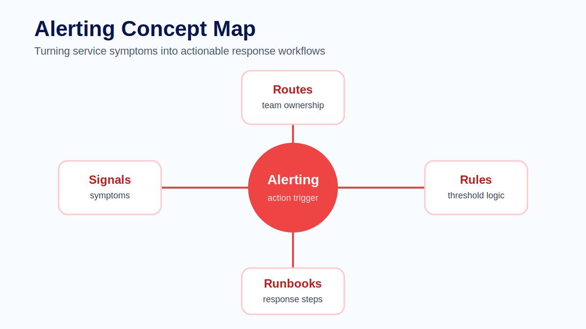
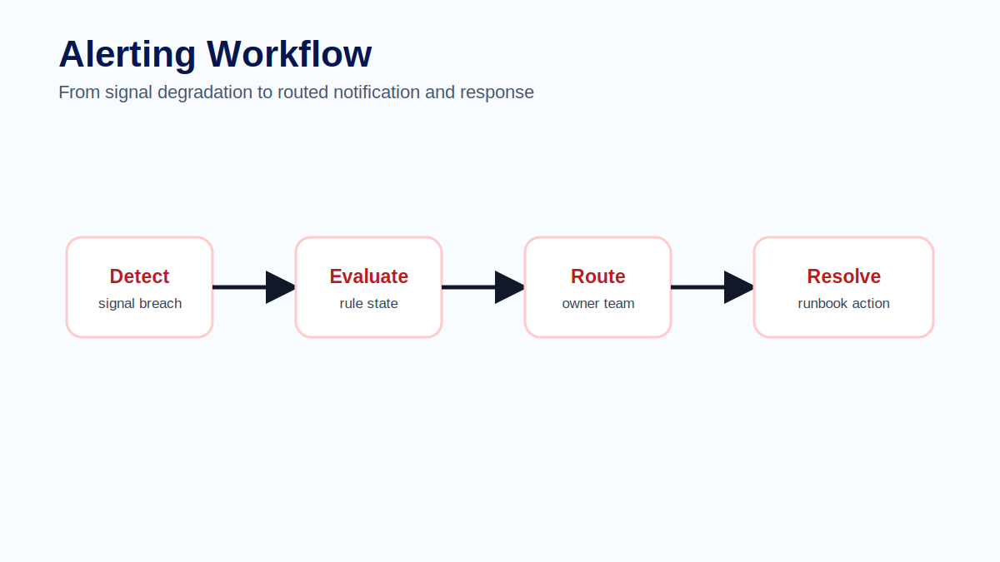
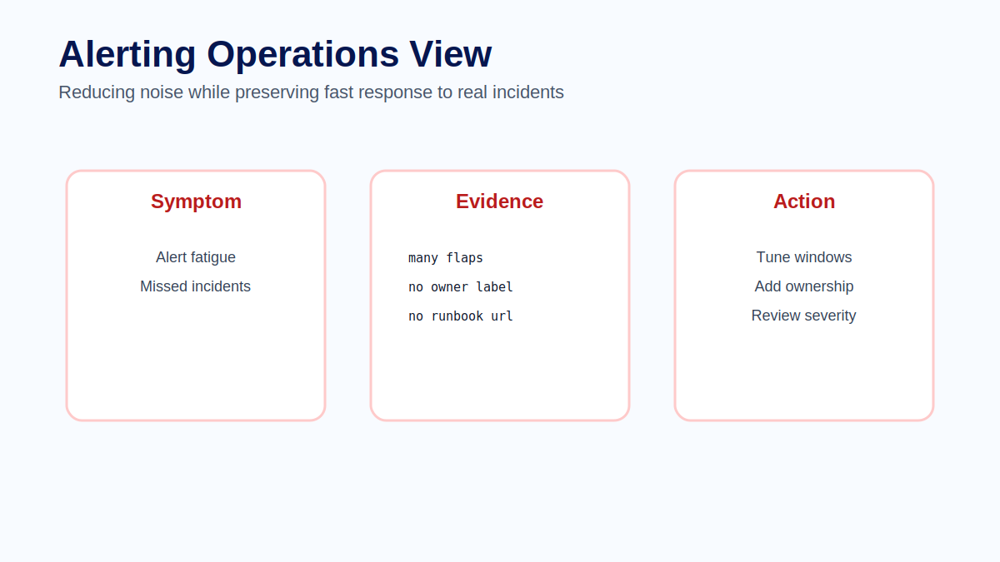

# Module 12 - Alerting

## Course context

Alerting is not the same as monitoring. Monitoring observes conditions. Alerting asks someone to take action. That distinction matters because every alert consumes attention. A good alert wakes the right team for a condition that matters and provides enough context to start response. A poor alert creates noise, fatigue and distrust.

Alerting should be designed around user impact, ownership and response. If nobody knows what to do when an alert fires, the alert is incomplete.

## What makes an alert actionable

An actionable alert has a clear symptom, clear impact, clear owner and clear next step. It should explain what is wrong, why it matters and where to investigate first.

A CPU alert may be useful for infrastructure teams, but it may not directly represent user impact. A checkout error-rate alert or payment authorization latency alert may be more actionable for a service team because it describes a customer-facing symptom.

## Rule design

Alert rules should balance sensitivity and stability. A threshold that fires on every small spike creates noise. A threshold that waits too long may miss incidents. Time windows, burn rates, severity and routing should reflect the urgency of the condition.

Alerts should include labels such as service, environment, severity and owner. They should also link to dashboards, traces, logs or runbooks. The alert message should be written for the person who receives it at an inconvenient time.

## Routing and escalation

Routing determines who receives the alert. Escalation determines what happens if the first response does not resolve the issue. These are organizational decisions as much as technical ones.

Every alert should have an owner. Unowned alerts become noise. Alerts should be reviewed regularly because systems change, teams change and historical thresholds may no longer be valid.

## Common mistakes

Common mistakes include alerting on every low-level resource metric, missing ownership labels, using vague alert names, failing to include runbook links and never deleting obsolete alerts. Another common problem is alerting on symptoms that are already handled automatically.

## Exercise

Design an alert for elevated checkout error rate. Define the signal, threshold, evaluation window, severity, owner, dashboard link, trace/log starting point and first runbook action. Then explain how you would test the alert safely.

## Quiz

1. What makes an alert actionable?
2. Why is ownership important?
3. How can short evaluation windows create noise?
4. What should an alert message include?
5. Why should alerts be reviewed regularly?

## Key takeaways

- Alerts are requests for human action.
- Good alerts are owned, contextual and testable.
- Alert fatigue is a reliability risk.
- Routing and runbooks are part of alert design.

## Official references

- Grafana Alerting: https://grafana.com/docs/grafana/latest/alerting/
- Prometheus Alerting: https://prometheus.io/docs/alerting/latest/overview/
- Prometheus Alerting Rules: https://prometheus.io/docs/prometheus/latest/configuration/alerting_rules/
- OpenTelemetry Metrics: https://opentelemetry.io/docs/specs/otel/metrics/
