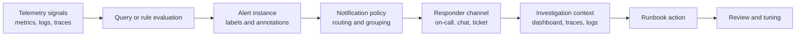

# Module 12 - Alerting

## Introduction

Alerting is where observability becomes an operational commitment. Dashboards help teams understand a system, but alerts interrupt people and ask them to act. That difference is critical. A monitoring system can collect thousands of useful signals, while an alerting system should page only for conditions that need human response.

Good alerting is not defined by the number of rules. It is defined by the quality of the decisions it supports. A strong alert describes a user-visible symptom, identifies the affected service, routes to the right owner, provides investigation context and links to a runbook that explains the first response steps. A weak alert only says that a number crossed a threshold.

This module teaches alerting as a production design discipline. Learners will connect telemetry signals to actionable rules, notification policies, escalation paths, dashboards, traces, logs and post-incident review.

## Learning Objectives

By the end of this module, learners will be able to:

- Explain the difference between monitoring and alerting.
- Design alerts around symptoms, ownership and response.
- Choose alert severity based on user impact and urgency.
- Use labels and annotations to route alerts and provide responder context.
- Balance sensitivity and stability with evaluation windows and thresholds.
- Explain when cause-based alerts are useful and when they create noise.
- Connect alert rules to dashboards, logs, traces and runbooks.
- Review, test and retire alerts as production systems evolve.

## Prerequisites

Learners should already understand the OpenTelemetry signal model, service-level telemetry, ClickHouse-backed analysis and Grafana dashboard design from earlier modules. They do not need previous Grafana Alerting experience, but they should understand why logs, metrics and traces answer different operational questions.

## Module Structure

This module follows the production lifecycle of an alert:

1. Define the operational intent.
2. Select the signal and rule logic.
3. Attach labels, annotations and ownership.
4. Route the alert to the right responder.
5. Provide investigation context and a runbook.
6. Test the alert safely.
7. Review, tune or retire the alert over time.

## Theory

### Monitoring is observation; alerting is interruption

Monitoring observes system behavior. Alerting interrupts a person or workflow because the system requires attention. This distinction should shape every alerting decision.

A dashboard panel can show CPU usage, request rate, error rate, latency, queue depth, deployment state and database pressure. Not every one of those signals deserves an alert. If every unusual condition pages a team, responders learn to ignore the system. Alert fatigue is a reliability risk because it delays response to real incidents.

The first question for any alert is not "Can we detect this?" The better question is "What should someone do when this fires?" If the answer is unclear, the alert is not ready.

### Actionability

An actionable alert has four properties:

- Clear symptom: it describes the behavior that is wrong.
- Clear impact: it explains why the condition matters.
- Clear owner: it routes to the team responsible for response.
- Clear next step: it gives the responder a practical starting point.

A message such as `High CPU on node-17` may be useful for an infrastructure team, but it is often too far from customer impact for an application team. A message such as `Checkout error rate is above the page threshold in production` is usually more actionable because it describes a user-facing symptom and points to the business workflow under stress.

### Symptoms and causes

Production alerting should favor symptoms over causes for paging alerts. A symptom tells responders that users or critical workflows are affected. A cause tells responders that an internal component is behaving unusually.

Cause-based alerts are still useful, especially for owned infrastructure, capacity constraints and conditions that will soon become user-visible. However, cause alerts should be handled carefully because they can duplicate symptom alerts or page teams for conditions that self-heal.

A practical model is:

- Page for urgent user-impacting symptoms.
- Notify for early warning conditions that need attention during working hours.
- Record diagnostic signals in dashboards without alerting when no action is required.

### Severity

Severity should represent urgency and impact, not technical drama. A high-cardinality error affecting one development namespace is not the same as checkout failures across production. Severity decisions should consider affected users, business workflow, duration, blast radius, error budget burn and whether automation can recover the system.

A simple production severity model is:

| Severity | Meaning | Response expectation |
| --- | --- | --- |
| Critical | Active or imminent user-impacting outage | Page the on-call responder immediately |
| Warning | Degraded behavior or fast-moving risk | Notify the owning team and investigate promptly |
| Informational | Useful operational signal with no immediate action | Record in dashboard or ticket workflow |

Severity should be encoded as a label because notification policies depend on it.

## Architecture

Alerting is a response pipeline, not just a query. The rule is only one part of the design.

A production alert should carry enough metadata to survive this pipeline. Labels such as `service`, `environment`, `severity`, `team`, `region` and `slo` support routing and grouping. Annotations such as summary, description, dashboard URL, runbook URL and query intent support human response.

## Rule Design

### Signal selection

Choose the signal that best represents the condition. For user-facing services, error rate, latency and availability are often better paging signals than CPU, memory or pod restarts. Resource metrics can still be important, but they should be tied to operational intent.

For a checkout service, useful alert candidates might include:

- Elevated `5xx` response rate for checkout requests.
- Payment authorization latency above the customer-impact threshold.
- Sustained failure to publish order events.
- Error budget burn rate high enough to threaten the service objective.

### Thresholds and windows

Thresholds define what is abnormal. Evaluation windows define how long the abnormal condition must persist before the alert fires. Both are trade-offs.

Short windows detect incidents quickly but can create noise during brief spikes. Long windows reduce noise but can delay response. The right window depends on the service, the cost of interruption and how quickly the condition harms users.

For critical services, teams often combine fast and slow views. A short-window alert catches severe incidents quickly, while a longer-window alert catches sustained degradation that may not spike dramatically.

### Burn-rate thinking

Error budget burn rate is a useful way to align alerts with reliability objectives. Instead of alerting only when a raw error percentage crosses a static threshold, burn-rate alerts ask whether the service is consuming its allowed failure budget too quickly.

This approach is valuable because it connects alerting to user impact and service objectives. It also helps avoid paging for small changes that are technically visible but operationally harmless.

### Labels and annotations

Labels should be stable routing dimensions. They are meant for machines and policies. Annotations should be human-readable context. They are meant for responders.

A good alert instance should answer:

- What is affected?
- How serious is it?
- Who owns it?
- Where should I look first?
- What is the first safe action?

Avoid putting too much volatile data into labels. Highly variable labels can create many alert instances and make grouping harder.

## Production Example

Consider a checkout service that exposes request metrics through OpenTelemetry and stores historical telemetry in ClickHouse. Grafana evaluates an alert rule against checkout error rate in production.

A publication-quality alert design might look like this:

| Field | Example |
| --- | --- |
| Alert name | `CheckoutHighErrorRate` |
| Symptom | Checkout requests are returning elevated server errors |
| Signal | Error-rate metric filtered to `service.name="checkout"` and `environment="production"` |
| Severity | Critical when sustained above the page threshold |
| Owner | Checkout platform team |
| Routing | Production checkout on-call policy |
| Dashboard | Checkout service health dashboard |
| Trace starting point | Recent failed checkout traces filtered by `service.name` and status |
| Log starting point | Error logs grouped by exception type and deployment version |
| Runbook action | Check current deployment, dependency health and payment gateway error distribution |
| Safe test method | Trigger in a non-production folder or lower threshold in a controlled test rule |

This alert is stronger than a generic `High HTTP 500s` alert because it names the workflow, owner, environment and investigation path.

## Walkthrough

Designing a production alert is a sequence of decisions.

First, define the operational question. For checkout, the question might be: "Are users currently unable to complete purchases at an unacceptable rate?"

Second, select the signal. Error rate is a better first signal than CPU because it represents workflow failure. CPU may become part of investigation, but it is not the symptom.

Third, choose the evaluation strategy. A very short window might catch a spike, but it may also page during a transient dependency retry. A longer window may reduce noise, but it delays response. The team should tune this based on service objectives and incident history.

Fourth, attach labels and annotations. Labels route the alert. Annotations tell the responder why the alert matters and where to start.

Fifth, test the alert safely. Alert tests should avoid paging the wrong team or polluting production incident channels. Use staging policies, test folders, explicit test labels or notification contact points designed for validation.

Finally, review the alert after real incidents. If the alert fired too late, too often or without enough context, adjust it. Alert quality improves through operational feedback.

## Best Practices

Prefer alerts that describe user impact. Resource alerts can be valuable, but they should not dominate the paging surface unless the infrastructure team owns the response and the condition requires action.

Keep alert names specific and consistent. `CheckoutHighErrorRate` is easier to route, search and discuss than `Errors high`.

Use labels for ownership, environment, service and severity. Routing rules depend on these fields, and consistent labels prevent brittle notification policies.

Include runbook and dashboard links in annotations. A responder should not need to search documentation while under pressure.

Design grouping intentionally. Related alert instances should group together when they represent the same incident, but unrelated services should not hide behind one grouped notification.

Use silences and maintenance windows responsibly. Planned work should not create alert noise, but silences must have an owner, scope and expiration.

Review alert history. Alerts that never fire, fire constantly or never lead to action should be tuned or removed.

## Common Mistakes

The most common mistake is alerting on every metric that looks important. Observability data is useful even when it does not generate notifications. Dashboards and exploratory queries are better homes for many diagnostic signals.

Another mistake is paging on causes before symptoms. For example, a pod restart may not affect users. If the restart creates checkout failures, the checkout symptom alert should page. The restart event can still help the responder investigate.

Teams also create problems when alerts lack owners. An unowned alert eventually becomes background noise because nobody is accountable for improving it.

Vague annotations are another failure mode. "Threshold exceeded" tells the responder almost nothing. The annotation should describe the impact, the likely starting points and the runbook.

Finally, many teams forget alert lifecycle management. Systems change, teams reorganize and thresholds age. Alert rules need maintenance just like code.

## Architect Notes

Alerting design should be part of service ownership. A service is not production-ready only because it emits telemetry. It is production-ready when the owning team can detect user-impacting failure, route response, investigate quickly and learn from incidents.

Do not treat alerting as a central platform-only activity. Platform teams can provide Grafana, notification policies, templates and guardrails, but service teams understand their own user journeys and failure modes. The best operating model combines platform consistency with service-level ownership.

In regulated or high-availability environments, alert definitions may also need version control, peer review and change history. Treat critical alert rules as production configuration.

## Did You Know?

A quiet alerting system is not automatically healthy. It may mean the system is stable, but it may also mean important symptoms are not covered. Alert quality should be reviewed against incidents, support tickets and user-impact reports, not only against alert volume.

## Interview Questions

1. What is the difference between monitoring and alerting?
2. Why should paging alerts usually focus on symptoms rather than causes?
3. What information should be included in alert labels and annotations?
4. How do evaluation windows affect alert noise and detection speed?
5. What makes an alert actionable?
6. How would you design an alert for elevated checkout error rate?
7. Why can unowned alerts become dangerous?
8. How do silences and maintenance windows reduce noise, and what risks do they introduce?
9. How can burn-rate alerting improve reliability-focused alert design?
10. What should a team review after an alert fires during a real incident?

## Hands-on Lab

Complete the dedicated exercise and lab materials for this module:

- [Exercise - Checkout error-rate alert](exercise.md)
- [Lab - Checkout alert rule examples](../../labs/module-12-alert-rule-examples.md)
- [Quiz - Review questions and answers](quiz.md)
- [Official references](references.md)

The lab should produce an alert design that includes the signal, threshold, evaluation window, severity, owner, routing target, dashboard link, trace or log starting point, first runbook action and safe test method.

## Lab Solution

A strong solution should define a checkout error-rate alert using a user-impacting production signal. The rule should use a stable service and environment filter, a clear page threshold, an evaluation window that avoids transient noise and a severity label that matches the response expectation.

The alert should route to the checkout owning team. It should include annotations with a concise summary, a dashboard link, a runbook link and investigation hints such as recent deployment version, failed trace examples and grouped error logs. The safe test method should validate rule evaluation and notification routing without paging the wrong responder.

A weak solution alerts only on CPU, uses no owner label, sends notifications to a generic channel and provides no runbook. That design may detect technical change, but it does not reliably support incident response.

## Summary

Alerting turns telemetry into action. The best alerts are not the loudest; they are the clearest. They describe a meaningful symptom, route to the right owner, provide response context and improve through operational review.

The goal is not to eliminate all failures. The goal is to detect important failures quickly, reduce confusion during response and avoid exhausting the teams responsible for production systems.

## Key Takeaways

- Alerts are requests for human or automated action.
- Actionable alerts describe symptoms, impact, ownership and next steps.
- Severity should reflect urgency and user impact.
- Labels support routing; annotations support responders.
- Evaluation windows trade detection speed against noise.
- Runbooks, dashboards, traces and logs are part of alert design.
- Alerts require lifecycle management and regular review.

## References

- Grafana Alerting: https://grafana.com/docs/grafana/latest/alerting/
- Prometheus Alerting: https://prometheus.io/docs/alerting/latest/overview/
- Prometheus Alerting Rules: https://prometheus.io/docs/prometheus/latest/configuration/alerting_rules/
- OpenTelemetry Metrics: https://opentelemetry.io/docs/specs/otel/metrics/

## Next Module

Module 13 consolidates observability best practices across instrumentation, storage, dashboards and alerting so teams can move from isolated tooling to a reliable production operating model.
