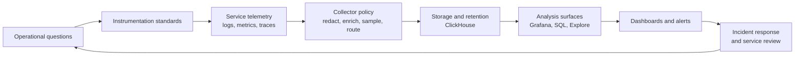
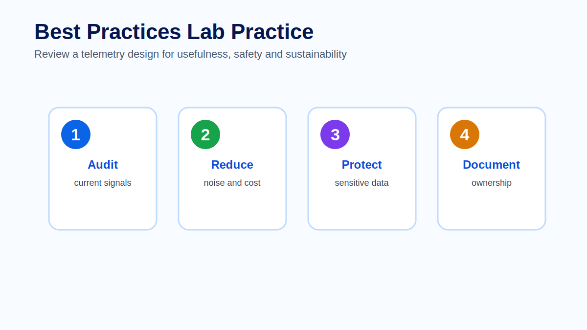

# Module 13 - Best Practices

## Introduction

Observability is not successful because a team collects many signals. It is successful when those signals help people operate systems better. Mature observability balances visibility, cost, safety, ownership and response.

This module consolidates the course. Earlier modules explained the pieces: OpenTelemetry, logs, metrics, traces, context propagation, instrumentation, ClickHouse, Grafana dashboards and alerting. This module explains how to operate those pieces as a coherent production practice.

Best practices matter because telemetry can become a production problem of its own. Too much data increases cost. Poor naming reduces trust. Sensitive attributes create risk. Unowned dashboards and alerts decay into clutter. A strong observability practice gives teams enough evidence to make good decisions without creating unnecessary operational weight.

## Learning Objectives

By the end of this module, learners will be able to:

- Explain why observability is an operating discipline, not only a toolchain.
- Design telemetry from operational questions instead of collecting data by default.
- Evaluate signal quality across logs, metrics, traces and resource attributes.
- Identify cost drivers such as volume, cardinality, retention and expensive queries.
- Explain privacy and governance risks in telemetry pipelines.
- Define ownership for instrumentation, Collector pipelines, dashboards and alerts.
- Use an observability maturity model to plan gradual improvement.
- Run a practical telemetry design audit for a production service.

## Prerequisites

Learners should have completed the previous modules covering OpenTelemetry signals, the Collector, logs, metrics, traces, context propagation, instrumentation, ClickHouse, Grafana, dashboards and alerting. This module assumes learners can recognize the main telemetry signal types and understand how they flow through a production observability platform.

## Module Structure

This module is organized around five production questions:

1. What decisions must observability support?
2. Are the signals consistent, contextual and safe?
3. Where do cost and performance risks appear?
4. Who owns each observability asset?
5. How does the organization improve over time?

## Theory

### Observability starts with questions

Start with operational questions. What must the team know during an incident? Which symptoms affect users? Which dependencies are most risky? Which business operations require auditability? Which signals help decide whether a release is healthy?

Telemetry without a question is often noise. It may look useful when created, but it rarely helps under pressure. The best instrumentation decisions begin with the decisions humans and automated systems must make later.

Examples of useful operational questions include:

- Are users able to complete checkout successfully?
- Which dependency is adding latency to payment authorization?
- Did the latest deployment change error rate or tail latency?
- Which customer-impacting alerts fired during the incident?
- Which log events help explain failed orders without exposing sensitive data?

These questions guide what to instrument, what to retain, what to aggregate, what to visualize and what to alert on.

### Signal quality

Good telemetry is consistent, contextual and actionable. Service names should be stable. Environments should be labeled consistently. Spans should have meaningful names. Logs should include correlation identifiers. Metrics should use safe labels. Dashboards and alerts should reflect real operational workflows.

Signal quality is not theoretical. It affects incident response directly. If two teams use different environment names, a production query may miss data. If a metric label contains user IDs, cardinality may explode. If spans have generic names, traces will show timing but not meaning. If logs lack trace identifiers, responders lose the ability to move from a symptom to evidence.

### Cost control

Observability cost is influenced by volume, cardinality, retention, sampling strategy and query patterns. Cost control does not mean removing useful evidence. It means choosing what to keep at full fidelity, what to sample, what to aggregate and what to retain for shorter periods.

Common cost drivers include:

- High-volume debug logs sent to production storage.
- Metrics with unbounded labels such as user ID, session ID or raw URL.
- Trace spans that duplicate low-value internal operations.
- Dashboards that run broad historical queries every few seconds.
- Retention policies that keep all signals at the same fidelity for too long.

Cost optimization should preserve the evidence needed for incidents, compliance and service review. Blindly dropping telemetry may reduce a bill while increasing operational risk.

### Privacy and governance

Telemetry can contain sensitive information. Teams should avoid collecting secrets, personal data, payment data, raw payloads and authorization headers unless there is a clear, approved and controlled reason.

Governance is the set of standards and review practices that keeps telemetry safe and useful. It includes semantic conventions, attribute naming, redaction, retention, access control, dashboard ownership, alert ownership and change review for critical pipelines.

The OpenTelemetry Collector is often a governance control point because it can enrich, filter, sample, redact and route telemetry before it reaches storage or analysis systems.

### Ownership

Observability assets need owners. Instrumentation has owners. Collector pipelines have owners. Dashboards have owners. Alerts have owners. Runbooks have owners.

Ownership does not mean one central platform team owns every signal. A better model is shared responsibility:

| Asset | Typical owner | Responsibility |
| --- | --- | --- |
| Service instrumentation | Service team | Emit useful, safe and consistent telemetry. |
| Collector platform | Platform or SRE team | Provide reliable pipelines and policy controls. |
| ClickHouse storage | Platform or data infrastructure team | Manage schema, retention, capacity and performance. |
| Grafana dashboards | Service or platform team | Keep views useful, trusted and aligned with users. |
| Alerts and runbooks | Owning service team | Ensure alerts are actionable and response-ready. |
| Standards | Architecture, platform and engineering leadership | Maintain conventions and review expectations. |

Unowned observability assets decay quickly because no one is accountable for tuning, deletion or correction.

## Architecture

A production observability practice connects service ownership, telemetry pipelines, storage, visualization, alerting and review.

The loop matters. Observability should improve through real use. Incidents, slow investigations, noisy alerts, expensive queries and missing evidence should feed back into instrumentation and platform standards.

## Observability Maturity Model

A maturity model helps teams improve gradually instead of treating best practices as an all-or-nothing checklist.

| Level | Description | Typical risk |
| --- | --- | --- |
| 1. Visible | Signals exist, but naming and coverage are inconsistent. | Teams can see data but cannot trust it during incidents. |
| 2. Standardized | Services use consistent names, environments and core attributes. | Some signals are useful, but workflows may still be disconnected. |
| 3. Workflow-ready | Telemetry supports dashboards, alerts and incident response. | Cost and ownership may become harder as adoption grows. |
| 4. Governed | Cost, privacy, retention and ownership are reviewed intentionally. | Governance can slow teams if standards are unclear or heavy. |
| 5. Continuously improving | Incidents and reviews feed back into telemetry design. | Requires discipline, leadership support and regular maintenance. |

Most organizations do not move through these levels uniformly. One critical service may be mature while another is still at the visibility stage. The goal is to improve the services and workflows that matter most first.

## Production Example

A platform team reviews observability for a checkout service after several slow incidents. The service emits logs, metrics and traces, but responders report that investigations still take too long.

The review finds these issues:

| Finding | Impact | Improvement |
| --- | --- | --- |
| Logs include raw request payloads | Privacy and storage risk | Redact payloads and keep structured error fields. |
| Metrics include `customer_id` as a label | High-cardinality cost risk | Remove user identifiers from metric labels. |
| Spans use generic operation names | Traces are hard to interpret | Rename spans around business operations such as payment authorization. |
| Dashboard panels have no owner | Panels remain after service changes | Assign dashboard ownership to checkout team. |
| Alert links to a broad dashboard only | Responders lose time finding evidence | Add runbook, focused panel links and trace/log starting points. |

The result is not simply less telemetry. It is better telemetry: safer, cheaper, easier to query and more useful during incidents.

## Walkthrough

A practical telemetry design audit can be run in seven steps.

First, choose a service and a workflow that matters. Do not audit everything at once. Start with a critical user journey such as checkout, login or payment authorization.

Second, write the operational questions. Ask what the team must know during incident response, deployment review and capacity planning.

Third, inspect real telemetry. Review traces, logs, metrics, dashboards and alert history from production or a representative environment.

Fourth, classify signals. Mark each signal as useful, noisy, risky, missing or unclear. Useful signals answer a known question. Noisy signals consume attention or cost without supporting decisions.

Fifth, identify risks. Look for high cardinality, sensitive data, inconsistent naming, missing correlation, excessive retention, broad dashboard queries and unactionable alerts.

Sixth, assign owners and improvements. Every dashboard, alert, Collector rule and instrumentation change should have an owner.

Seventh, review after change. After the next deployment or incident, confirm whether the improvements reduced investigation time, noise or cost.

## Best Practices

Design telemetry from questions. Instrumentation should support incident response, service review, reliability objectives, capacity planning and business-critical workflows.

Standardize service identity. Consistent `service.name`, environment, region and deployment metadata make cross-signal correlation much easier.

Use semantic conventions where they apply. Standard naming reduces translation cost between teams and tools.

Protect sensitive data early. Redaction and filtering should happen before telemetry reaches broad storage or dashboards whenever possible.

Control cardinality deliberately. Labels and attributes should help grouping and filtering without creating unbounded dimensions.

Treat the Collector as a policy layer. Use it to enrich, filter, sample, redact and route telemetry consistently.

Align retention with value. Not every signal needs the same retention period or fidelity. Keep what supports incidents, trends and compliance.

Review dashboards and alerts like production assets. If a dashboard or alert has no owner, it should be fixed or retired.

Measure observability outcomes. Useful indicators include time to detect, time to investigate, alert noise, dashboard usage, query cost and incident review findings.

## Common Mistakes

A common mistake is treating observability as a tool purchase. Tools are necessary, but they do not create useful telemetry by themselves. Teams still need naming standards, instrumentation strategy, ownership and review.

Another mistake is copying dashboards between services without adapting them. A dashboard that works for a stateless API may not fit a queue consumer, batch job or payment integration.

Teams often ignore cost until it becomes urgent. By that point, storage, queries and dashboards may depend on expensive patterns that are hard to unwind.

Sensitive data in telemetry is another serious failure mode. Once secrets or personal data reach shared observability storage, cleanup can become operationally and legally complex.

Finally, organizations sometimes centralize too much ownership. A platform team can provide standards and tooling, but service teams must own whether their telemetry explains their own systems.

## Architect Notes

Observability governance should be lightweight enough to support delivery and strong enough to prevent chaos. Heavy approval processes can discourage teams from improving instrumentation. No standards at all can create naming drift, cost surprises and unsafe data collection.

A useful architecture pattern is to define a small set of required conventions centrally, then let service teams extend telemetry for their own workflows. Required conventions might include service identity, environment naming, sensitive data rules, core RED or USE metrics, trace propagation and alert ownership labels.

Critical services may need stricter review because their telemetry supports incident response, customer commitments or compliance. Treat observability standards as production engineering standards, not documentation preferences.

## Did You Know?

The cheapest telemetry is not always the best telemetry, and the most complete telemetry is not always the safest. Mature teams optimize for decision quality per unit of cost, risk and operational effort.

## Interview Questions

1. Why should observability design start with operational questions?
2. What does signal quality mean across logs, metrics and traces?
3. How can high-cardinality metric labels affect cost and reliability?
4. What telemetry data should usually be redacted or avoided?
5. How would you divide observability ownership between platform and service teams?
6. Why is the OpenTelemetry Collector a useful governance point?
7. What is the difference between reducing telemetry cost and losing operational evidence?
8. How would you review whether a dashboard is still useful?
9. What maturity level would you expect from a critical production checkout service?
10. How should incident reviews feed back into observability design?

## Hands-on Lab

Complete the dedicated exercise and review materials for this module:

- [Exercise - Telemetry design audit](exercise.md)
- [Quiz - Review questions and answers](quiz.md)
- [Official references](references.md)

The lab asks learners to audit one service for usefulness, noise, cost, privacy and ownership. The expected output is not a generic checklist. It should be a concrete improvement plan that preserves useful evidence while reducing risk and waste.

## Lab Solution

A strong solution should identify one useful signal, one noisy signal, one cost risk, one privacy risk and one missing owner. It should then propose concrete improvements.

For example, a checkout service audit might produce:

| Category | Finding | Improvement |
| --- | --- | --- |
| Useful signal | Checkout error-rate metric supports alerting and service review. | Keep it and ensure labels include service, environment and route group. |
| Noisy signal | Debug logs from successful requests dominate log volume. | Drop or sample them in production. |
| Cost risk | Metric label includes raw request path with order IDs. | Normalize route names and remove unbounded identifiers. |
| Privacy risk | Logs include customer email in error context. | Redact the field and keep a safe customer segment or request ID if needed. |
| Missing owner | The checkout dashboard has no named maintainer. | Assign ownership to the checkout team and review after release changes. |

A weak solution only says "reduce logs" or "add dashboards" without explaining the decision, owner or production consequence.

## Summary

Observability best practices are not abstract ideals. They are practical ways to make production systems easier to operate. The strongest teams design telemetry from questions, keep signals consistent, control cost, protect sensitive data, assign ownership and continuously improve from real incidents.

The purpose of observability is better operational judgment. Every signal, dashboard and alert should earn its place by helping teams make better decisions.

## Key Takeaways

- Observability is an operating discipline, not a tooling checkbox.
- Useful telemetry answers production questions.
- Signal quality depends on consistency, context, safety and actionability.
- Cost is shaped by volume, cardinality, retention and query behavior.
- Privacy and governance must be designed into telemetry pipelines.
- Ownership prevents observability assets from decaying.
- Mature observability improves through incident review and service change.

## References

- OpenTelemetry Documentation: https://opentelemetry.io/docs/
- OpenTelemetry Semantic Conventions: https://opentelemetry.io/docs/specs/semconv/
- Grafana Dashboard Best Practices: https://grafana.com/docs/grafana/latest/dashboards/build-dashboards/best-practices/
- CNCF TAG Observability: https://tag-observability.cncf.io/

## Next Module

Module 14 closes the course with a production case study that connects instrumentation, Collector pipelines, ClickHouse storage, Grafana dashboards, alerting and response into one end-to-end operating model.
