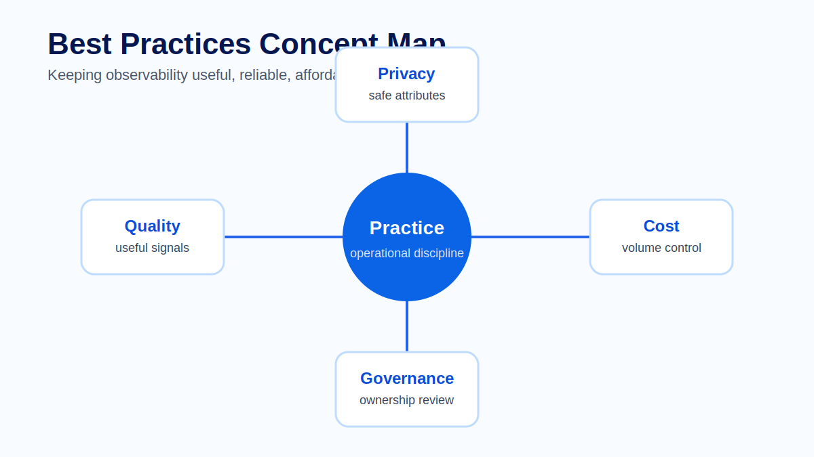
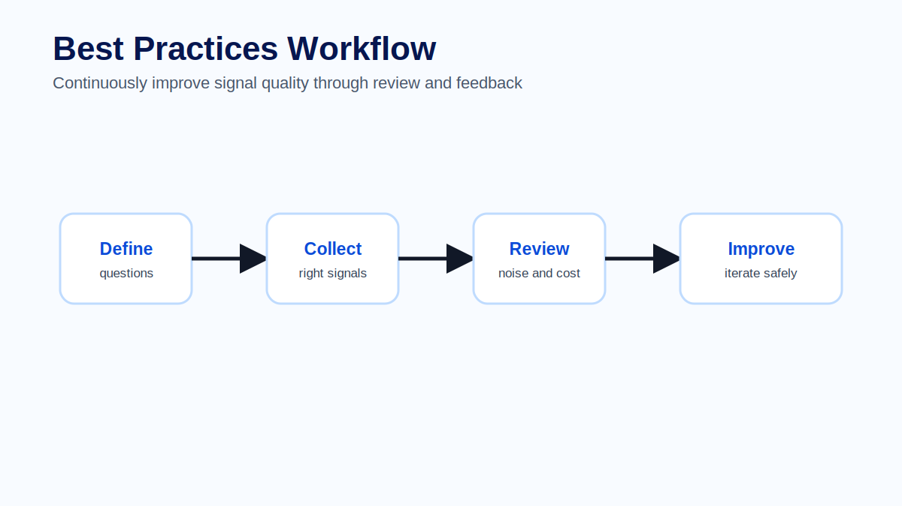
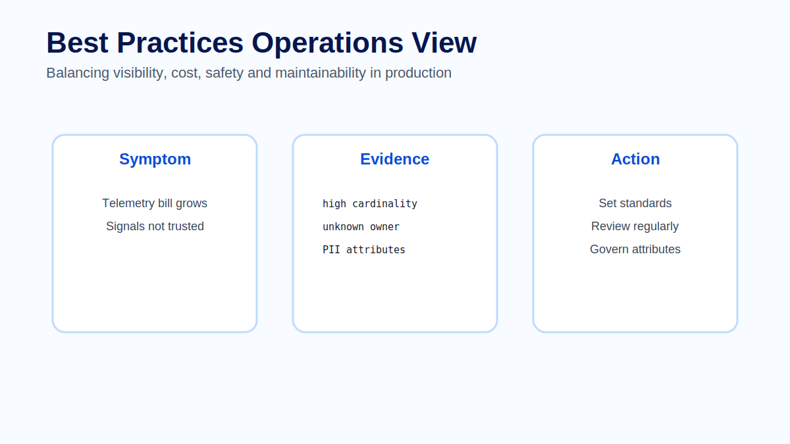

# Module 13 - Best Practices

## Course context

Observability is not successful because a team collects many signals. It is successful when those signals help people operate systems better. Mature observability balances visibility, cost, safety and ownership.

Best practices are important because telemetry can become a production problem of its own. Too much data increases cost. Poor naming reduces trust. Sensitive attributes create risk. Unowned dashboards and alerts become clutter.

## Design from questions

Start with operational questions. What must the team know during an incident? Which symptoms affect users? Which dependencies are most risky? Which business operations require auditability? These questions should guide instrumentation, dashboards and alerts.

Telemetry without a question is often noise. It may look useful when created, but it rarely helps under pressure.

## Signal quality

Good telemetry is consistent, contextual and actionable. Service names should be stable. Environments should be labeled consistently. Spans should have meaningful names. Logs should include correlation identifiers. Metrics should use safe labels.

Signal quality should be reviewed. Teams should inspect real traces, dashboards and logs after deployment to confirm that the data supports investigation.

## Cost control

Observability cost is influenced by volume, cardinality, retention and query patterns. Cost control does not mean removing useful evidence. It means choosing what to keep at full fidelity, what to sample, what to aggregate and what to retain for shorter periods.

Common strategies include tail sampling for traces, filtering noisy logs, controlling metric labels, using retention policies and pre-aggregating expensive dashboard queries.

## Privacy and governance

Telemetry can contain sensitive information. Teams should avoid collecting secrets, personal data and raw payloads unless there is a clear and approved reason. Attribute naming and redaction should be part of platform standards.

Ownership is also essential. Dashboards, alerts, Collector pipelines and instrumentation should have maintainers. Unowned observability assets decay quickly.

## Common mistakes

Common mistakes include treating observability as a tool purchase, copying dashboards between services without context, ignoring cost until it becomes urgent, failing to document ownership and allowing sensitive data into telemetry.

## Exercise

Audit a telemetry design for one service. Identify one useful signal, one noisy signal, one cost risk, one privacy risk and one missing owner. Propose concrete improvements for each.

## Quiz

1. Why should telemetry design start with questions?
2. What is signal quality?
3. How can high cardinality affect cost?
4. Why is telemetry privacy important?
5. What happens to unowned dashboards and alerts?

## Key takeaways

- Observability is an operating discipline.
- Useful telemetry answers production questions.
- Cost, privacy and ownership must be designed intentionally.
- Observability assets need regular review.

## Official references

- OpenTelemetry Best Practices: https://opentelemetry.io/docs/
- OpenTelemetry Semantic Conventions: https://opentelemetry.io/docs/specs/semconv/
- Grafana Best Practices: https://grafana.com/docs/grafana/latest/dashboards/build-dashboards/best-practices/
- CNCF TAG Observability: https://tag-observability.cncf.io/
