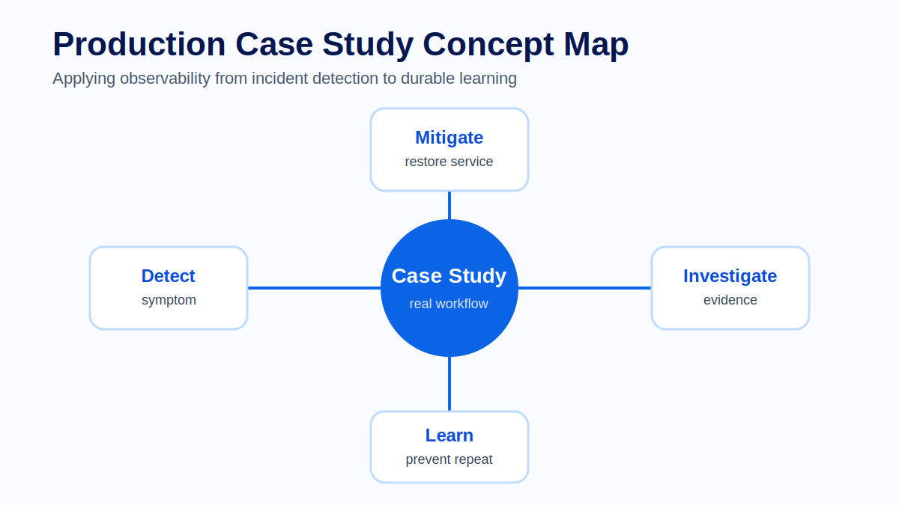
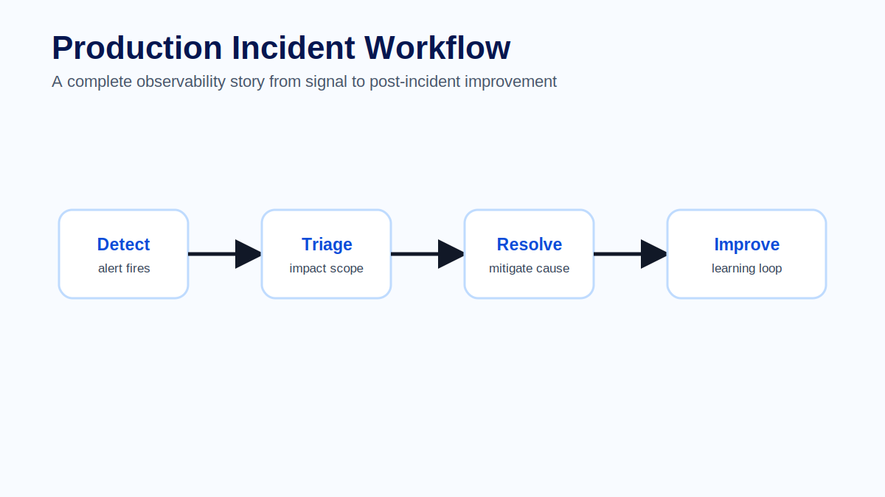
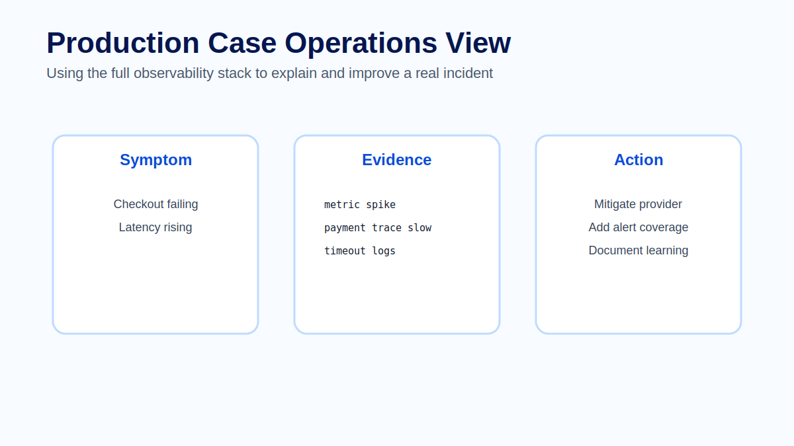

# Module 14 - Production Case Study

## Course context

The final module connects the full observability workflow. Instead of studying logs, metrics, traces, dashboards and alerts separately, learners walk through a production-style incident and use each signal at the right moment.

The purpose of a case study is not to create a dramatic story. It is to practice evidence-based thinking. During incidents, teams need to avoid assumptions, follow the data and make decisions that restore service safely.

## Scenario

A checkout workflow is failing intermittently. Operators report that some users cannot complete orders. The alerting system reports elevated checkout error rate. The dashboard shows p95 latency increasing at the same time as payment failures.

The first goal is to understand impact. Which service is affected? Which users or environments are affected? When did the issue start? Is it tied to a deployment, dependency or infrastructure condition?

## Investigation path

Start with the alert and dashboard. Metrics show the shape of the problem: error rate, request volume and latency. The dashboard confirms that the issue is concentrated in checkout and payment authorization.

Open traces for failed or slow checkout requests. The trace shows that most time is spent in the payment provider call. Several traces show the same slow span and error status.

Use trace ids to inspect logs. Logs confirm provider timeouts and retry attempts. The error is not caused by user input or database latency. The evidence points to a downstream dependency problem.

## Mitigation

A good mitigation should reduce user impact while preserving evidence. Possible actions include routing to a fallback provider, increasing timeout only if safe, temporarily disabling a non-critical payment path or communicating dependency degradation.

After mitigation, metrics should show error rate and latency improving. Traces should confirm that the slow span is no longer on the critical path. Logs should show fewer timeouts.

## Learning and prevention

The incident is not finished when the service recovers. The team should document what happened, what signals were useful, what was missing and what should change.

Possible improvements include a dependency-specific dashboard, a payment-provider alert, better span attributes for provider name and outcome, a runbook for provider degradation and a retention rule for failed checkout traces.

## Common mistakes

Common mistakes include jumping to the first plausible cause, ignoring user impact, changing multiple things at once, failing to preserve evidence and writing a postmortem that lists events without explaining decisions.

## Exercise

Work through the case study as an incident team. Assign roles: incident lead, telemetry investigator and scribe. Build a timeline with symptom, metric evidence, trace evidence, log evidence, mitigation and follow-up actions. Finish with three concrete improvements to the observability platform.

## Quiz

1. Why should investigation start with impact?
2. Which signal shows the shape of the incident?
3. Which signal identifies the slow dependency?
4. Why are trace ids useful when inspecting logs?
5. What should happen after service recovery?

## Key takeaways

- Incidents require evidence, not guesses.
- Metrics show impact and trend.
- Traces identify request path and latency.
- Logs provide detailed event evidence.
- Post-incident learning improves future observability.

## Official references

- OpenTelemetry Documentation: https://opentelemetry.io/docs/
- Grafana Incident and Alerting Documentation: https://grafana.com/docs/grafana/latest/alerting/
- ClickHouse Documentation: https://clickhouse.com/docs
- W3C Trace Context: https://www.w3.org/TR/trace-context/
