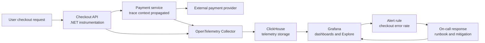
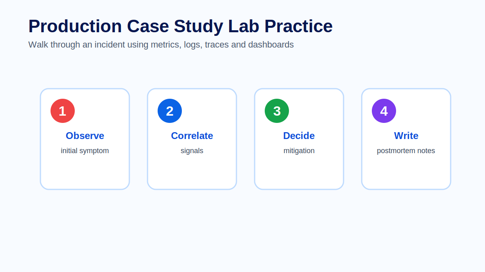

# Module 14 - Production Case Study

## Introduction

The final module connects the full observability workflow. Instead of studying logs, metrics, traces, dashboards and alerts separately, learners work through a production-style incident and use each signal at the right moment.

The purpose of a case study is not to create a dramatic story. It is to practice evidence-based thinking. During incidents, teams need to avoid assumptions, follow the data, communicate impact and make changes that restore service safely.

This module is the capstone for the course. It connects .NET instrumentation, OpenTelemetry context propagation, Collector pipelines, ClickHouse storage, Grafana dashboards, alerting, runbooks and post-incident learning into one operating model.


## Learning Objectives

By the end of this module, learners will be able to:

- Explain how telemetry moves from instrumented services to investigation and response workflows.
- Use metrics, traces and logs in the right sequence during an incident.
- Start an investigation from user impact rather than from a guessed root cause.
- Follow trace context from a dashboard symptom into traces and correlated logs.
- Evaluate mitigation options using risk, blast radius and validation criteria.
- Preserve useful evidence while restoring service.
- Produce concrete post-incident improvements for instrumentation, dashboards, alerts and runbooks.
- Describe how OpenTelemetry, ClickHouse and Grafana work together in a production operating model.

## Prerequisites

Learners should have completed the previous modules. They should understand OpenTelemetry signals, the Collector, logs, metrics, traces, context propagation, instrumentation, ClickHouse query workflows, Grafana dashboards, alerting and observability best practices.

## Module Structure

This case study follows the lifecycle of a production incident:

1. Detect the symptom.
2. Confirm user impact.
3. Use metrics to understand shape and scope.
4. Use traces to locate the slow or failing path.
5. Use logs to confirm detailed failure evidence.
6. Choose and execute a mitigation.
7. Validate recovery.
8. Capture follow-up improvements.

## Theory

### Incidents require evidence, not guesses

A production incident creates pressure. Under pressure, teams often jump to the first plausible explanation: a new deployment, a database issue, a dependency outage or an infrastructure problem. Sometimes the first guess is right. Often it is not.

Evidence-based response reduces avoidable risk. It asks responders to connect every action to a signal: an alert, a metric trend, a trace pattern, a log event, a deployment record or a dependency status. The goal is not to delay mitigation. The goal is to make mitigation safer and easier to validate.

### Start with impact

Impact determines urgency, scope and communication. Before looking for a root cause, responders should understand who is affected, what workflow is affected, when the issue started and whether the condition is getting worse.

A good first incident statement is specific:

```text
Production checkout is intermittently failing for a subset of users. Error rate and p95 latency increased at 14:05 UTC. The issue appears concentrated in payment authorization.
```

That statement is stronger than:

```text
Payment is broken.
```

The first statement gives scope, symptom, time and an evidence direction. The second creates anxiety but not operational clarity.

### Use signals in sequence

Metrics, traces and logs answer different questions.

| Signal | Primary incident question |
| --- | --- |
| Metrics | How big is the problem, when did it start and is it improving? |
| Traces | Where in the request path is time or failure concentrated? |
| Logs | What detailed event or error confirms the behavior? |
| Dashboards | What shared view helps the team coordinate? |
| Alerts | What symptom required action and who should respond? |

The sequence is not rigid, but it is useful. Metrics show shape. Traces show path. Logs show detail. Dashboards and alerts keep the team aligned.

## Architecture

The case study uses a checkout workflow instrumented with OpenTelemetry and operated through ClickHouse and Grafana.



The important detail is the feedback loop. Instrumentation emits the evidence, the Collector applies platform policy, ClickHouse stores and exposes the data, Grafana turns the data into shared operational views and alerting brings responders into the workflow when user impact crosses a threshold.

## Production Scenario

A checkout workflow is failing intermittently. Operators report that some users cannot complete orders. The alerting system reports elevated checkout error rate. The dashboard shows p95 latency increasing at the same time as payment failures.

The environment has the following components:

- A .NET checkout API instrumented with OpenTelemetry.
- A payment service that receives propagated W3C trace context.
- An OpenTelemetry Collector that enriches telemetry with environment and cluster metadata.
- ClickHouse tables storing traces, logs and metrics-derived events for investigation.
- Grafana dashboards for checkout health and payment dependency health.
- Grafana alerting rules for checkout error rate and latency.
- A runbook for checkout degradation.

The first goal is to understand impact. Which service is affected? Which users or environments are affected? When did the issue start? Is it tied to a deployment, dependency or infrastructure condition?


## Walkthrough

### 1. Detect and declare

The alert fires:

```text
CheckoutHighErrorRate critical production
Checkout server errors are above the page threshold for 10 minutes.
```

The incident lead checks whether the alert is actionable. It has an owner, dashboard link, runbook link and service labels. Because the alert describes a user-facing symptom in production, the team declares an incident and starts a timeline.

### 2. Confirm impact with metrics

The telemetry investigator opens the checkout dashboard. Metrics show:

- Error rate increased from a normal baseline to a sustained elevated level.
- p95 latency increased at nearly the same time.
- Request volume is normal, so the issue is not simply a traffic surge.
- The issue is concentrated in production checkout routes that call payment authorization.

The team updates the impact statement:

```text
Checkout failures started at 14:05 UTC. The issue affects production payment authorization paths. Traffic volume is normal, but error rate and p95 latency are elevated.
```

### 3. Move from metric symptom to traces

The investigator opens traces for failed and slow checkout requests. Several traces show the same pattern:

- Checkout API receives the request normally.
- Inventory and cart validation spans complete quickly.
- Payment authorization span is slow.
- Some payment spans end with timeout errors.
- The trace context remains intact across checkout and payment service boundaries.

This narrows the investigation. The database is not the first suspect. User input is not the first suspect. The slow span points to payment authorization.

### 4. Use trace IDs to inspect logs

The investigator copies trace IDs from failed requests and queries related logs. Logs confirm provider timeouts and retry attempts. They also show that failures are concentrated on one external provider route and began shortly after a provider-side degradation notice.

The evidence chain now looks like this:

| Evidence | Finding |
| --- | --- |
| Alert | Checkout error rate crossed the page threshold. |
| Metrics | Error rate and p95 latency increased in production checkout. |
| Traces | Slow and failed spans concentrate in payment authorization. |
| Logs | Provider timeout errors occur for the same trace IDs. |
| Dependency status | Payment provider route reports degradation. |

### 5. Choose mitigation

The team considers several options.

| Option | Advantage | Risk |
| --- | --- | --- |
| Roll back checkout | Fast if caused by deployment | Evidence does not point to checkout deployment. |
| Increase timeout | May reduce failures | Could make user latency worse and hold resources longer. |
| Route to fallback provider | Reduces dependency impact | Requires confidence that fallback path is healthy. |
| Disable non-critical payment path | Limits blast radius | May reduce available payment options. |
| Wait for provider recovery | Avoids risky change | Leaves users affected. |

Based on evidence, the team routes eligible payment traffic to the fallback provider and temporarily disables the degraded non-critical payment path. They avoid changing multiple unrelated things at once.

### 6. Validate recovery

After mitigation, the team watches the same signals used to diagnose the incident:

- Checkout error rate decreases.
- p95 latency returns toward baseline.
- Payment timeout logs decrease.
- New traces show the fallback provider span on the critical path.
- Alert state returns to normal after the evaluation window.

Validation is essential. A mitigation is not complete because someone made a change. It is complete when user-impacting symptoms improve and the team can explain why.

### 7. Preserve evidence and learn

The incident is not finished when the service recovers. The team captures the timeline, evidence, decisions and follow-up work.

A concise incident timeline might look like this:

| Time | Event | Evidence | Decision |
| --- | --- | --- | --- |
| 14:05 | Checkout latency and errors rise | Dashboard metrics | Start investigation. |
| 14:10 | Alert pages checkout on-call | Grafana alert | Declare incident. |
| 14:14 | Slow payment spans identified | Traces | Focus on payment authorization. |
| 14:18 | Provider timeouts confirmed | Logs correlated by trace ID | Check dependency health. |
| 14:23 | Provider route degraded | Provider status and logs | Route to fallback provider. |
| 14:32 | Error rate improves | Metrics and alert state | Continue monitoring. |
| 15:00 | Incident review scheduled | Timeline and evidence | Create follow-up actions. |


## Best Practices

Start with impact. Root cause analysis matters, but incident response begins with the affected users, workflows and severity.

Use shared dashboards during coordination. A dashboard gives the team a common view and reduces repeated explanation.

Preserve trace context across service boundaries. Without propagation, responders lose the path from checkout to payment and logs become harder to correlate.

Validate every mitigation with the same symptom signals that detected the incident. If error rate and latency do not improve, the change may not have addressed user impact.

Avoid changing multiple unrelated things at once. Multiple simultaneous changes make recovery harder to interpret and can introduce new failure modes.

Write follow-up work as concrete engineering tasks. "Improve observability" is not enough. A useful action has an owner, a change and a verification method.

## Common Mistakes

A common mistake is investigating the most familiar component instead of the most supported hypothesis. If a team always blames the database first, it may waste valuable time during a payment dependency issue.

Another mistake is treating the alert as the root cause. An alert is a symptom detector. It should start investigation, not end it.

Teams also fail when they do not preserve evidence. Restarting services, changing sampling or deleting logs before capturing trace IDs can make the incident impossible to understand later.

Changing too many things at once is dangerous. If rollback, timeout changes and fallback routing happen simultaneously, the team may not know which action helped.

A weak post-incident review lists events but does not explain decisions. The review should explain why responders chose each action and what evidence supported it.

## Architect Notes

A capstone incident reveals whether the observability platform is truly integrated. If metrics show impact but traces cannot identify the path, instrumentation or propagation needs work. If traces identify the failing dependency but logs cannot confirm error detail, correlation needs work. If dashboards are useful but alerts are noisy, alert design needs work. If responders know the issue but cannot mitigate safely, runbooks and operational ownership need work.

Architects should design observability as an incident workflow, not as a collection of independent tools. The platform should help teams move from symptom to evidence to action with as little translation as possible.

## Did You Know?

Trace IDs are most valuable when they travel across boundaries and appear in logs. A trace without correlated logs may show where time was spent, but correlated logs often explain what the service decided at that moment.

## Interview Questions

1. Why should incident investigation start with impact rather than root cause?
2. How do metrics, traces and logs complement each other during an incident?
3. What does trace context propagation enable in this case study?
4. Why is it risky to change multiple things at once during mitigation?
5. How would you validate that fallback routing improved checkout health?
6. What evidence would make you suspect the payment provider rather than the checkout database?
7. What should be included in a useful incident timeline?
8. How can ClickHouse support post-incident analysis?
9. What follow-up improvements would you make after this incident?
10. How would you know whether the observability platform helped or slowed the response?

## Hands-on Lab

Complete the dedicated exercise and review materials for this module:

- [Exercise - Incident team walkthrough](exercise.md)
- [Quiz - Review questions and answers](quiz.md)
- [Official references](references.md)

The lab should produce an incident timeline, an evidence chain, a mitigation decision, validation signals and three concrete follow-up improvements.



## Lab Solution

A strong lab solution should include:

| Required output | Example |
| --- | --- |
| Impact statement | Production checkout has elevated failures and latency, concentrated in payment authorization. |
| Metric evidence | Error rate and p95 latency increased at 14:05 UTC while traffic remained normal. |
| Trace evidence | Failed checkout traces show slow payment provider spans. |
| Log evidence | Correlated logs show provider timeouts for the same trace IDs. |
| Mitigation | Route eligible traffic to fallback provider and disable degraded non-critical payment path. |
| Validation | Error rate drops, latency improves, timeout logs decrease and alert returns to normal. |
| Follow-up 1 | Add dependency-specific dashboard panels for payment provider routes. |
| Follow-up 2 | Add span attributes for provider name, route and outcome. |
| Follow-up 3 | Improve runbook with fallback routing steps and validation queries. |

A weak solution jumps directly to rollback, ignores trace evidence, does not validate recovery or ends with vague follow-up items such as "monitor better".

## Summary

This case study shows the full observability system working as one workflow. OpenTelemetry instrumentation creates evidence. Context propagation connects services. The Collector applies platform policy. ClickHouse stores data for investigation. Grafana dashboards and alerts expose user impact. Runbooks and incident roles turn evidence into action. Post-incident review turns action into learning.

The course began with observability concepts and ends with operational judgment. Tools matter, but the real goal is a team that can understand production behavior, respond safely and improve continuously.

## Key Takeaways

- Incidents require evidence, not guesses.
- Metrics show impact, trend and scope.
- Traces identify request path, latency and failing dependencies.
- Logs provide detailed event evidence when correlated by trace ID.
- Mitigation should reduce user impact while preserving useful evidence.
- Recovery must be validated with telemetry.
- Post-incident learning should create concrete, owned improvements.
- OpenTelemetry, ClickHouse and Grafana are most valuable when they support one coherent operating workflow.

## References

- OpenTelemetry Documentation: https://opentelemetry.io/docs/
- Grafana Alerting: https://grafana.com/docs/grafana/latest/alerting/
- ClickHouse Documentation: https://clickhouse.com/docs
- W3C Trace Context: https://www.w3.org/TR/trace-context/

## Course Wrap-up

Learners should now be able to explain and design an observability platform from first principles: instrument services, propagate context, collect telemetry, store and query it efficiently, build trustworthy dashboards, design actionable alerts and use the resulting evidence during real production work.
